# Overview
The tracertools package is a collection of Python functions designed to streamline common tasks for connectomics researchers, particularly those related to the proofreading process. 

# Installation
Quick installation from the Python Package Index (PyPI) with pip isn't supported yet (but is planned for the future), so you'll have to intall the tracertools package manually from this GitHub repository by doing the following:

1. Open a terminal and navigate to the directory where you want the tracertools package to be stored.
2. Run the code `git clone https://github.com/jaybgager/tracertools.git` to make a local copy of the package at the location you navigated to in step one. This will create a folder named `tracertools` that's linked to the GitHub repository in the location you were in when you ran the `clone` command.
3. In the terminal, navigate one folder down, so that you're in the top-level folder of the `tracertools` package by running the command `cd tracertools`.
4. In the terminal, run the command `pip install -e .` (it may take a minute to run). This will tell Python's default installer, pip, to add the folder you're currently in to its list of importable packages. The `-e` modifier causes this installation to be "editable", meaning that if you make changes to the code stored in the `tracertools` folder, they'll take effect when you import the tracertools package into a Python script. This is important for keeping the package up-to-date, so you don't have to reinstall it every time there are changes. This also lets you expriment with modifying the tools to meet your own needs. The `.` at the end just tells pip to install everything at the current directory location.

Now whenever you need to use a tracertools function, you can simply import it like any other package using the "import tracertools" code in any Python script. Then, when you want to use a function, you add `tracertools.` in front of it. For example, if you wanted to use the `get_current_seg_ids` function, you would use the following code:

```
import tracertools
fresh_ids = tracertools.get_current_seg_ids(
    datastack="brain_and_nerve_cord",
    seg_ids=[720575941586154052,720575941429544111]
)
```

You can also use an alias when importing the package; "tt" is a common choice. In that case, the above code would be modified slightly to look like this:

```
import tracertools as tt
fresh_ids = tt.get_current_seg_ids(
    datastack="brain_and_nerve_cord",
    seg_ids=[720575941586154052,720575941429544111]
)
```

>[!NOTE]
>Remember to periodically update your package by navigating tot he `tracertools` folder in the terminal and running the command `git pull` to get the latest changes from the github repository. If you've got an active kernel that was started before running the pull command (e.g. you've been using tracertools in a jupyter notebook), remember to restart the kernel after updating the package in order for the changes to take effect!

# Glossary of Common Terms
Some terms used in the function descriptions are either uncommon or are used here to mean something very specific in the context of this package. These are defined below:

**backbone (neuron)**\
A general collective term for the larger processes of a given neuron. Exact definitional criteria vary from source to source, but often requires microtubules to be visible in imaging where this is possible. Contrast to "twig". Frequently used as a proofreading standard for cell completion (e.g. `"backbone_proofread"`), as attaching every twig to a neuron is typically cost-prohibitive due to the difficulty and uneccessary due to biological redundancy between connected neurons.

**break**\
A segmentation error where the path of a neuronal process ends prematurely. Factors that increase the chances are thin diamter of the process and 2D imaging errors like dislocations, missing data, warping, or blurred focus. Often distinguishable in 3D by an abrupt end to a process with no tapering or branching, soemtimes accompanied by jagged mesh (potentially with concavities) at the break site. Requires manual merging with the missing process(es) by a proofreader. with Contrast with "merger".

**bucket**\
A server where files can be stored and accessed remotely. Often used for publicly hosting neuroglancer volumes containing meshes, annotation layers, or electron microscope (EM) image layers. Can also be used to host data tables for things like cell type labels, proofreading status, or synapse data. The functions that begin with the prefix `bucket_` relate to reading from and writing to buckets using the [cloudfiles](https://github.com/seung-lab/cloud-files) Python package.

**CAVE**\
Connectome annotation versioning engine, the software used to manage and interact with backend information about datastacks . This is done with the [caveclient](https://github.com/CAVEconnectome/CAVEclient) Python package, thorough documentation for which can be found [here](https://caveclient.readthedocs.io/en/latest/).

**chunkedgraph/pychunkedgraph/pcg**\
The chunkedgraph is an organizational structure that holds the information about which supervoxels belong to which segments. It's created and managed by the [pychunkedgraph (pcg) Python package](https://github.com/CAVEconnectome/PyChunkedGraph). Individual supervoxels are always considered to belong to the lowest layer, making them the "level 1 nodes", or "L1 nodes" for short. All the supervoxels belonging to a segment within a given cube of space, referred to as a "chunk", will be grouped together into a level 2 (L2) node. 

Multiple L2 nodes are grouped into an L3 node and so on until you reach a layer that contains all the supervoxels in the whole segment. For a more detailed explanation, read [this description](https://caveclient.readthedocs.io/en/latest/guide/chunkedgraph.html). Working with different layers can have advantages. For example, the L1 layer (usually just referred to as "the supervoxels") can provide detailed information at the cost of computational power, while the L2 nodes can provide information faster for less processing power, like cached 3D volume measurements - at the cost of being less reliable in certain contexts.

**cloudvolume**\
A Python package that allows reading and writing of neuroglancer volumes directly in RAM without having to write to a hard drive, documentation for which can be found [here](https://github.com/seung-lab/cloud-volume). Used in a number of processes including mesh-related operations, creating and hosting volumes both locally or on a bucket, and spatial segment lookup.

**DataFrame/df**\
A type of Python object generated using the [Pandas](https://www.w3schools.com/python/pandas/default.asp) Python package. Similar to a table or spreadsheet, but with various optimizations for searching and performing calculations on the data it contains. Commonly used as the storage format for CAVE tables of anntoations, edits, or segment information. Often abbreviated "df".

**dataset**\
The original image data (usually in the form of raw electron microscope images) for a specific brain (or other piece of tissue). Often identified by a descriptive acronym (e.g. Brain and Nerve Cord (BANC), Female Adult Fly Brain (FAFB)) or by the name of the organism that the tissue came from (e.g. "Minnie", "Basil"). This term is sometimes used interchangeably with "datastack" in other media, but won't be here.

**datastack**\
All the data associated with a particular project associated with a given dataset. Multiple datastacks can be associated with a single dataset (e.g. "flywire_fafb_production" and "flywire_fafb_public" are both datastacks associated with the FAFB dataset). 

This can include aligned EM images, 3D segmentation data, and tables of information for things like synapses, cell type labels, or nucleus locations. It may also include neuron skeletons, neuropil mesh layers, and other stack-specific information. This term is sometimes used interchangeably with "dataset" in other media, but won't be here.

**edge (graph)**\
A general term for the connection between two nodes in a graph. This could be a synapse between neurons, a connection between supervoxels in the same segment, or a link between two vertices of a mesh. Often stored as two numbers that in some way reference the ID or position of their endpoints in a list. 

**edge (mesh)**\
The lines connecting a mesh's vertices, representing the places where the mesh surface changes direction. Stored as pairs of index numbers pointing to the position of their endpoints in the mesh's list of vertices (e.g. [vertex A index #, vertex B index #])

**face**\
The flat planes that make up the surface of a 3D mesh. Can be any shape, but generally stored as triangles (sometimes called "tris") for rendering and mathematical analysis purposes. Can be stored either as lists/arrays of 3 points or 3 edges, depending on useage. May also be associated with a normal.

**fresh (segment ID)**\
A fresh segment ID is one that's currently in use in a live production datastack. It represents the most current information about a neuron or other structure. Any time an edit (split or merge) is made to a segment (in the case of splits) or segments (in the case of merges), the resulting segments (in the case of splits) or segment (in the case of merges) will be given a new unique ID (in the case of merges) or two new IDs (in the case of splits). A fresh ID is the one that all the supervoxels associated with it will register as currently belonging to. Interchangeable with "current", "latest", and "most recent". Contrast with "stale".

**graphene**\
A data format backed by pychunkedgraph, used by cloudvolume and the Seung Lab's custom version of neuroglancer, documentation for which can be found [here](https://github.com/seung-lab/cloud-volume/wiki/Graphene). If you see the term "graphene" in the address for a segmentation layer, it generally indicates that it's linked to the chunkedgraph in some way and will therefore show up as a "painted" overlay in the 2D window of neuroglancer, allowing a user to show or hide segments by double-clicking within them in 2D. Contrast with the term "precomputed", which generally indicates a static mesh that isn't connected to the chunkedgraph and therefore won't show up as a "painted" overlay in the 2D window of neuroglancer.

**JSON/JSON state/state JSON**\
[JavaScript Object Notation](https://en.wikipedia.org/wiki/JSON), abbreviated JSON, is a data format commonly used to store information in a structure similar to a Python dictionary, where there are "key" strings paired with values. The values can themselves be dictionary-like structures, creating multiple layers of nesting to allow for granular information storage. JSON format is often used for storign "state" information, or the information related to a specific configuration of settings that allows for saving and loading of specific setups for various programs, particularly on the internet. 

Neuroglancer uses JSON states to store all the information about a given snapshot of the user interface (UI) at a point in time. This might include the windows that are open, the layers that are present and their visibility, which segments are selected, the position of any annotations, the 3d view position and angle, and many other pieces of information. You can view the JSON state of a neuroglancer at any time by clicking on the `{}` icon in the top-right of the UI window, clicking on the dropdown arrows to expand the various sections. 

This state can be downloaded as a JSON state file on your local machine, from which all the information pertaining to that configuration of neuroglancer can be pulled if you know the methods and terms to use. When referring to an instance of this data type, the terms "JSON state" and "state JSON" are often used interchangeably. This package will always use "JSON state" since "JSON" is an adjective that's modifying the noun "state", except where the reverse is required by outside package fucntions.

**local**\
A term used to refer to something stored on the actual computer that you're using (e.g. your hard drive). Derived terms include "local path"/"local directory", "local machine", and "local host(ing)". Contrast with "remote".

**merge**\
An edit operation in neuroglancer that combines two segments into one new segment. This is done by manually placing a single line annotation with one end in each segment to be connected. Generally used during proofreading to attach missing branches or other structures to a neauron. Plural "merges". Contrast with "split". Not to be confused with "merger".

**merger**\
A single segment that is made of structures that actually belong to two or more different neurons or other tissue types, and which therefore requires splitting by a proofreader. Derived terms include "glial merger", "synapse site merger", and "z-plane merger". Plural "mergers". Contrast with "break". Not to be confused with "merge".

**mesh**\
A 3-dimensional shape, often representing a neuron, but sometimes used to depict other structures like organelles, nuclei, neuropils, or simply regions of space. Stored in literal terms as a collection of vertices, edges, and faces. A mesh is considered "watertight" if all its triangular faces are connected to exactly 3 other triangular faces (i.e. there are no "holes"). Many formats for storing mesh information exist, but this package primarily uses either those found in neuroglancer volumes or sometimes OBJ files. 

**neuroglancer/NG**\
A user interface (UI) for interacting with the 3D segmentation and rendering of neurons and other biological structures, the documentation for which can be found [here](https://github.com/google/neuroglancer). There are multiple branches of NG for specific purposes, like [FlyWire](https://github.com/seung-lab/ng-extend/tree/flywire) or [Spelunker](https://github.com/seung-lab/neuroglancer/tree/spelunker). Most of the functions in this package are built for use with Spelunker, the Seung Lab's current customized version of NG.

**normal (mesh)**\
A ray (line with a direction) aimed perpendicular (sometimes reffered to as "orthogonal") to a flat plane. Often used to indicate what direction a mesh face is oriented for the purposes of rendering lighting (i.e. which side of the face is the "outside" of the mesh).

**numpy/np/numpy array**\
A Python package commonly used for various mathematical tasks, often abbreviated as "np". Numpy arrays are similar to lists, but are considered their own object type in Python. They're often used by Python functions because they're faster and more versatile to work with than standard lists, particularly when doing matrix operations.

**path swap**\
A specific type of merger where the path of one neuronal process suddenly switches to follow the path of another. Particularly common when 2D image dislocation errors occur in parallel bundles. Can be quite hard to spot visually, but often shows up as unexpected patterns of connectivity compared to typical cells of the same type during synaptic analyses.

**parallel bundle**\
A biological structure where the paths of multiple neuronal processes run parallel and adjacent to one another for long stretches. Often the diameter of the processes can be quite thin, increasing the risk of path swaps or breaks if there are any defects in the 2D imagery.

**precomputed**\
A common type of formatting for neuroglancer data layers that relies on doing complex mathematical operations ahead of time (pre-computing) to allow faster use by the end user. 

If you see the term `precomputed` in the address for a segmentation layer, it generally indicates that it's a static mesh that isn't connected to the chunkedgraph and therefore won't show up as a "painted" overlay in the 2D window of neuroglancer. 

Contrast with the term `graphene`, which indicates that a mesh is linked to the chunkedgraph in some way and will therefore show up as a "painted" overlay in the 2D window of neuroglancer, allowing a user to show or hide segments by double-clicking within them in 2D. 

**process (neuron)**\
A general umbrella term for the long, thin structures that extend (or "proceed") from the cell body of a typical neuron or from other processes. Often used interchangeably with "tract", "neurite", "path", and "branch". "Backbones", "twigs", "axons", and "dendrites" would all be considered types of processes. Usage can sometimes overlap with "arbor", though that term more correctly refers to a collection of multiple processes branching out from a single initial process.

**remote**\
A term used to refer to something stored on a computer other than the one you're actually using. This could be another user's machine, a university-run server, or cloud server run by a private company (e.g. Google Cloud / Amazon Web Services). Derived terms include "remote host(ing)", "remote bucket", and "remote machine". Things that are hosted remotely will often require some kind of verification process in order to access (e.g. security tokens, SSH keys, password protection etc.)Contrast with local. 

**resolution**\
The actual, physical dimensions in nanometers represented by one "unit" in the x, y, and z directions of a 3D coordinate system, stored as a list/array of 3 numbers (e.g. `[4, 4, 45]` for the voxel dimensions in the "brain and nerve_cord" datastack). 

Common derived terms include "viewer resolution" (the default voxel resolution used when viewing a datastack in neuroglancer), "mip0 resolution" (the voxel resolution of the raw electron microscope images for a dataset), and "nanometer resolution" (where the x-, y-, and z-resolutions are all 1 nanometer, often used for backend spatial information storage and mathematical calculations).

**root ID**\
An umbrella term that can refer to the numeric identifier attached to a single supervoxel, chunkedgraph node, or segment. Appropriate to use when the entity in question can't be known ahead of time, as in the `get_roots_from_points` function, which can return either a segment or supervoxel ID dependingon the user's input. Often used in other sources interchangeably with the term "segment ID", but won't be here.

**segmement/segmentation/seg**\
The term "segment" refers to a group of supervoxels and how they're conencted together. Each segment is associated with a unique 18-digit numeric identifier ("segment ID" / "seg ID"). If a segment is edited by merging or splitting the resulting segment(s)'s ID(s) will be different, as the new collection(s) of supervoxels will be considered distinct. Each segment, therefore acts as a snapshot in time of a aprticular structure, typically a neuron, and is often associated with various other metrics like synapse counts, 3D volume, and cable length. The terms "segment" and "segment ID" are often used interchangeably with the terms "root" and "root ID" respectively in other sources, but won't be here, as those terms are more broad and can encomapss other things like supervoxels or L2 nodes. 

The term "segmentation" is a bit more broad, and can refer to either the entire set of all segments in a datastack (e.g. the "segmentation layer" in neuroglancer), or to the current way in which a segment is constructed for a particular structure (e.g. "the segmentation of a neuron").

Both "segment" and "segmentation" are often used casually to refer to the 3D mesh in a neuroglancer window, though this is technically inaccurate. The mesh is actually a simplified, smoothed rendering of the true segmentation, which would have a more jagged, blocky, "voxellated" look to it if rendered in 3D. However, this usage is still accurate when looking at the segmentation overlay in the 2D view, which preserves the true shape of each supervoxel.

**split**\
An edit operation in neuroglancer that separates one segment into two new segments. This is usually done with an automated tool, and is typically associated with multiple line annotations generated by said tool. Typically used to separate two structures that belong to different neurons (see "merger"). Contrast with "merge".

**stale (segment ID)**\
A stale segment ID is one that's no longer in use in a live production datastack. It represents archival information about a neuron or other structure at a certain point in time. Any time an edit (split or merge) is made to a segment (in the case of splits) or segments (in the case of merges), the resulting segments (in the case of splits) or segment (in the case of merges) will be given a new unique ID (in the case of merges) or two new IDs (in the case of splits). A stale ID acts as a record of all the supervoxels associated with a given segment at a specific point in time, even though those supervoxels won't register as belonging to it anymore when queried. Stale IDs are useful for comparative analyses of the proofreading process, as they allow lookup of historical data associate with that particular timepoint, including synapse counts, 3D volume, cable length, and other metrics. Interchangeable with "old", "outdated", and "historic". Contrast with "fresh".

**supervoxel**\
The smallest rearrangeable unit of a 3D segment, made up of multiple voxels. Not a consistent size. Sometimes referred to as the "watershed" layer because of [the type of algorithm](https://en.wikipedia.org/wiki/Watershed_(image_processing)) that led to their creation. Supervoxels cannot be broken apart, a quality sometimes referred to as being "atomic" (i.e. the smallest unbreakable constituent part of something). When referenceing the "nodes"/"leaves"/"layers" of the chunkedgraph, supervoxels are L1 - the foundational level. At any given time, a supervoxel will "belong to" a specific segment (and will therefore be associated with that segment's ID), but this assignment will change if that segment is edited.

**twigs (neuron)**\
A general term for the smaller, more peripheral processes of a neuron. Exact definitional criteria vary from source to source, but often rely on a lack of visible microtubules in visualizations where these can be seen. Contrast with "backbone". Twigs are often ignored during the proofreading process, as attaching every twig to a neuron is typically cost-prohibitive due to the difficulty and uneccessary due to biological redundancy between connected neurons.

**vertex**\
A single point in 3D space connected to other points. Used to represent the boundaries of a 3D mesh. Stored as a list or array of 3 numbers (e.g. `[1,2,3]`) corresponding to the point's x, y, and z coordinates, either in nanometers, or in voxels - the measurements for which may change depending on the voxel resolution of the datastack you're working with. Plural vertices.

**volume**\
A collection of neuroglancer-related assets that can include 2D image layers, 3D segmentation and meshing, segment skeletons, and annotations. Stored in a single folder/directory, often named `image`. Several formats exist depending on the type of mesh being used, more documentation about which can be found [here](https://github.com/google/neuroglancer/blob/master/src/datasource/precomputed/meshes.md). Some formats require colons `:` in several file names in order to function properly. This makes them incompatible with Windows OS, which reserves colons for Drive names and therefore forbids their use in file names.

**voxel**\
One unit of 3D space, shaped like a rectangular prism, the actual spatial dimensions of which vary from datastack to datastack. Compare to a 2-dimensional pixel. Multiple voxels are grouped together to form a supervoxel.

# Functions
In this section you'll find descriptions of each function in the `tracertools` package, with instructions on their use and examples, as well as notes and warnings about known issues, dependencies, or limitations they may have.

## Function Cluster Notes
The tracertools package includes several groups of functions that all work in a similar way or rely on a similar set of tools. Rather than rewrite the general information for these in each description, it's summarized here for brevity.

### Google Sheet Functions
All the Google-sheet-related functions in this package (those beginning with the `gsheet_` prefix) depend on the [gspread](https://docs.gspread.org/en/latest/) Python package and currently require a Google authentication token to be set up prior to use. The process for doing so is explained [here](https://docs.gspread.org/en/latest/oauth2.html#oauth-client-id). Support for Google service accounts will likely be added in the future.

You'll need permission to read and/or write the specific Google sheets you intend to work with, as well as their sheet keys. The sheet key for a Google sheet can be found in the url between `https://docs.google.com/spreadsheets/d/` and `/edit?`. For example, the sheet key used in the `gsheet_add_column` example above is `1AqIyrqSaEJFGD5Ff1fergwJ8-q0x2l0xCgO025C401c`.

> [!WARNING]
> When uploading floats or integers to Google sheets, large numbers may sometimes be converted to scientific notation - particularly if they end in several 0s. To avoid this for things like segment IDs, it's recommended to convert all numbers to strings prior to uploading.

## Function Descriptions, Instructions, and Examples


### bucket_convert_colons
Converts file names that include colons to a Windows-safe alternative and back. Takes a string with the `file_path` argument. By default, converts any colons `:` in the string to triple-underscores `___`. If the `to_windows` argument is set to `False`, converts triple underscores back to colons. Used to allow creation and download/upload of neuroglancer legacy-format volumes (which by necessity must include colons in several file names) on Windows machines (which strictly prohibit the use of colons in file names).

Example (to Windows):

```
# ----------------------------------------------------
# INPUT
# ----------------------------------------------------

import tracertools as tt

print(
    tt.bucket_convert_colons(
        file_path = "home/user/volumes/vol_01/mesh/1:0:1"
    )
)

# ----------------------------------------------------
# OUTPUT
# ----------------------------------------------------

"home/user/volumes/vol_01/mesh/1___0___1"
```

Example (from Windows):

```
# ----------------------------------------------------
# INPUT
# ----------------------------------------------------

import tracertools as tt

print(
    tt.bucket_convert_colons(
        file_path = "home/user/volumes/vol_01/mesh/1___0___1",
        to_windows = False,
    )
)

# ----------------------------------------------------
# OUTPUT
# ----------------------------------------------------

"home/user/volumes/vol_01/mesh/1:0:1"
```

### bucket_delete_file
Deletes a file on a cloudfiles-managed bucket. Takes an absolute file path on a cloudfiles-managed bucket as a string with the `file_path` argument and deletes the file.

### bucket_delete_folder
Deletes a folder and all its contents on a cloudfiles-managed bucket. Takes an absolute folder path on a cloudfiles-managed bucket as a string with the `folder_path` argument and deletes the folder, including everything contained within. Prompts the user with a confirmation window where they must type `DELETE` and hit enter to prevent accidental deletion. 

> [!NOTE]
> Requires write permission for the chosen bucket.

### bucket_download_file
Downloads a file from a cloudfiles-managed bucket. Takes an absolute file path on a cloudfiles-managed bucket as a string with the `bucket_path` argument and downloads the file. Tries to find a folder called `Downloads` in the home directory by default, but a specific absolute path to a different location can be optionally passed as a string with the `download_path` argument.

>[!WARNING]
>If this function is used on a Windows machine, any files that contain colons `:` in their filenames will have them converted to triple-underscores `___`. This is because Windows OS forbids the practice of including colons in filenames, as they're reserved for Drive names. This is a common issue with legacy-format neuroglancer volumes containing single-resolution unsharded meshes, which require several files to have colons in their names in order to function properly.

### bucket_download_folder
Downloads a folder from a cloudfiles-managed bucket. Takes an absolute folder path on a cloudfiles-managed bucket as a string with the `bucket_path` argument and downloads the folder and all its contents. Tries to find a folder called `Downloads` in the home directory by default, but a specific absolute path to a different location can be optionally passed as a string with the `download_path` argument.

>[!WARNING]
>If this function is used on a Windows machine, any files that contain colons `:` in their filenames will have them converted to triple-underscores `___`. This is because Windows OS forbids the practice of including colons in filenames, as they're reserved for Drive names. This is a common issue with legacy-format neuroglancer volumes containing single-resolution unsharded meshes, which require several files to have colons in their names in order to function properly.

### bucket_move_file
Moves a file from one folder to another on a cloudfiles-managed bucket. Takes an absolute file path on a cloudfiles-managed bucket as a string with the `file_path` argument and moves it to a new folder location on the bucket passed as a string of the absolute path to that folder with the `new_folder_path` argument. 

> [!NOTE]
> Requires write permission for the chosen bucket.

### bucket_rename_file
Renames a file in-place on a cloudfiles-managed bucket. Takes an absolute file path on a cloudfiles-managed bucket as a string with the `file_path` argument and renames using a string passed with the `new_name` argument. The new name should just be the name of the file (not an absolute path that includes any folders it was contained within) with the file extension if one was present in the original name. 

> [!NOTE]
> Requires write permission for the chosen bucket.

### bucket_upload_file
Uploads a file to a cloudfiles-managed bucket. Takes an absolute file path on your local machine to a file you want to upload as a string with the `local_path` argument and an absolute folder path to a bucket folder where you want the file to be saved as a string with the `bucket_path` argument, and copies your local file to the bucket location specified. If folders that don't yet exist are included in the `bucket_path` argument, they'll be created. 

> [!NOTE]
> Requires write permission for the chosen bucket.

>[!WARNING]
>If this function is used on a Windows machine, any files that contain triple-underscores `___` in their filenames will have them converted to colons `:`. This is because Windows OS forbids the practice of including colons in filenames, as they're reserved for Drive names. This is a common issue with legacy-format neuroglancer volumes containing single-resolution unsharded meshes, which require several files to have colons in their names in order to function properly.

### bucket_upload_folder
Uploads a folder to a cloudfiles-managed bucket. Takes an absolute folder path on your local machine to a folder you want to upload as a string with the `local_path` argument and an absolute folder path to a bucket folder where you want the file to be saved as a string with the `bucket_path` argument, and copies the contents of your local folder to the folder specified on the bucket. If folders that don't yet exist are included in the `bucket_path` argument, they'll be created.

> [!NOTE]
> The last folder in the bucket path will be the new top-level folder (i.e. if your local folder is called "image" and you want to put it at a bucket location of "bucket/test_images" you should set the `bucket_path` argument equal to `bucket/test/images/image`). This format is intended to allow you to rename the folder when uploading if desired. 

> [!NOTE]
> Requires write permission for the chosen bucket.

>[!WARNING]
>If this function is used on a Windows machine, any files that contain triple-underscores `___` in their filenames will have them converted to colons `:`. This is because Windows OS forbids the practice of including colons in filenames, as they're reserved for Drive names. This is a common issue with legacy-format neuroglancer volumes containing single-resolution unsharded meshes, which require several files to have colons in their names in order to function properly.

### calc_3d_distance
Calculates the distance between two points in 3D. Takes two points as lists of 3 integers representing their x,y, and z coordinates with the `point_a` and `point_b` arguments and a the resolution of the coordinate system as a list of 3 integers with the `res` argument, and returns the distance between the two points as a float. Units will be the same as whatever was used for the `res` argument.

Example:

```
# ----------------------------------------------------
# INPUT
# ----------------------------------------------------

import tracertools as tt

print(
    tt.calc_3d_distance(
        point_a = [1,2,3],
        point_b = [4,5,6],
        res = [4,4,45],
    )
)

# ----------------------------------------------------
# OUTPUT
# ----------------------------------------------------

136.0624856453828
```

### calc_avg_point_coords
Gets the average point coordinates from a list of point coordinates. Takes a list of point coordinates as lists of 3 ints with the `points` argument and returns coordinates for a single point that represents the average of all the points in the list. By default returns result as list of nearest int values, but exact float values can be obtained insted by setting `exact_value` argument to `True`.

Example:

```
# ----------------------------------------------------
# INPUT
# ----------------------------------------------------

import tracertools as tt

print(
    tt.calc_avg_point_coords(
        points = [
            [1,4,3],
            [0,1,2],
            [2,1,3],
        ],
    )
)

# ----------------------------------------------------
# OUTPUT
# ----------------------------------------------------

[1,2,3]
```

Example (Exact Values):

```
# ----------------------------------------------------
# INPUT
# ----------------------------------------------------

import tracertools as tt

print(
    tt.calc_avg_point_coords(
        points = [
            [1,4,3],
            [0,1,2],
            [2,1,3],
        ],
        exact_value = True
    )
)

# ----------------------------------------------------
# OUTPUT
# ----------------------------------------------------

[1.0, 2.0, 2.6666666666666665]
```

### calc_bbox_corners_from_center
Calculates the point coordinates for the corners of a rectangular prism shaped bounding box based on a centerpoint and a set of dimensions. Takes a list of 3 ints with the `center_point` argument and a set of dimensions in the x-, y-, and z-dimensions as a list of ints with the `dims` argument and returns a list of two lists of 3 ints representing the corners of a bounding box of the requested dimensions centered on the requested point. 

> [!NOTE]
> If odd dimension values are submitted they'll be rounded down to the next even integer to avoid using floats for the corner coordinates.

Example:

```
# ----------------------------------------------------
# INPUT
# ----------------------------------------------------

import tracertools as tt

print(
    tt.calc_bbox_corners_from_center(
        center_point = [1,2,3],
        dims = [10,7,4],
    )
)

# ----------------------------------------------------
# OUTPUT
# ----------------------------------------------------

[[-4, -1, 1], [6, 5, 5]]
```


### calc_line_triangle_intersect
Calculates the point where a line segment and a triangular plane intersect, if any. Takes a line segment as an array of two arrays of 3 floats or ints representing the endpoints with the `line` argument (e.g. `[[x1,y1,z1],[x2,y2,z2]]`) and a triangular plane as an array of 3 arrays of 3 floats or ints representing the point coordinates of the vertices with the `triangle` argument (e.g. `[[x1,y1,z1],[x2,y2,z2],[x3,y3,z3]]`) and returns either an array of 3 floats representing the point coordinates where the line intersects the triangular plane (e.g. `[x,y,z]`) or a `None` value if none exist. 

By default, rounds the results to the nearest integer, but more detailed results can be obtained by setting the `precision` argument to the number of decimal places desired. Warning: using high precision (e.g. 16+ decimal places) with low numbers (e.g. [1,1,1]) can cause false negatives. This is due to extremely small rounding errors when calculating floating point math.

Example:

```
# ----------------------------------------------------
# INPUT
# ----------------------------------------------------

import tracertools as tt
import numpy as np

intersect = tt.calc_line_triangle_intersect(
    line = np.array(
        [
            [0,0,0],
            [1,2,3]
        ]
    ),
    triangle = np.array(
        [
            [2,0,0],
            [0,3,0],
            [0,0,4]
        ]
    ),
)

print(intersect)

# ----------------------------------------------------
# OUTPUT
# ----------------------------------------------------

[1.,1.,2.]

```

Example (higher precision):

```
# ----------------------------------------------------
# INPUT
# ----------------------------------------------------

import tracertools as tt
import numpy as np

intersect = tt.calc_line_triangle_intersect(
    line = np.array(
        [
            [0,0,0],
            [1,2,3]
        ]
    ),
    triangle = np.array(
        [
            [2,0,0],
            [0,3,0],
            [0,0,4]
        ]
    ),
    precision=3,
)

print(intersect)

# ----------------------------------------------------
# OUTPUT
# ----------------------------------------------------

[0.522 1.043 1.565]

```

### calc_seg_mesh_intersect
Calculates all points where the skeleton of a segment intersects a mesh, if any exist. Takes a datastack name as a string with the `datastack` argument, a list of segment IDs as ints with the `seg_ids` argument, and the address of a neuroglancer mesh as a string with the `mesh_address` argument and by default returns a list of bool (True/False) values indicating which segments' skeletons intersect the chosen mesh.

Optionally setting the `return_intersects` argument to True will instead return a list of items that are either lists of all the point coordinates at which each segment intersects the mesh as (3)-shape numpy arrays of floats or a `None` value if no intersection points exist.

Example:

```
# ----------------------------------------------------
# INPUT
# ----------------------------------------------------

import tracertools as tt

tt.calc_seg_mesh_intersect(
    datastack="brain_and_nerve_cord", 
    seg_ids=[720575941526718564,720575941524165453], 
    mesh_address="https://c10s.pni.princeton.edu/tracers/examples/banc_mesh_01|neuroglancer-precomputed:",
)

# ----------------------------------------------------
#OUTPUT
# ----------------------------------------------------

[True,False]
```

Example (return intersects):

```
# ----------------------------------------------------
# INPUT
# ----------------------------------------------------

import tracertools as tt

tt.calc_seg_mesh_intersect(
    datastack="brain_and_nerve_cord", 
    seg_ids=[720575941526718564,720575941524165453], 
    mesh_address="https://c10s.pni.princeton.edu/tracers/examples/banc_mesh_01|neuroglancer-precomputed:",
    return_intersects=True,
)

# ----------------------------------------------------
#OUTPUT
# ----------------------------------------------------

[
    [
        array([121305., 181906.,   4627.]),
        array([123200., 172384.,   4720.]),
        array([124027., 174945.,   5243.]),
        array([124240., 176101.,   5346.]),
        array([123934., 175092.,   5244.]),
        array([127158., 175525.,   4693.]),
        array([125175., 175250.,   5344.]),
        array([125127., 174504.,   5263.]),
        array([125315., 175057.,   5311.]),
        array([122142., 175971.,   4855.])
    ],
    None
]
```

### calc_skeleton_mesh_intersect
Calculates all points where a skeleton intersects a mesh, if any exist. Takes a segment's skeleton as an (n,2,3)-shape numpy array of floats with the `bones` argument and a list of triangular mesh faces as an (n,3,3)-shape numpy array of floats with the `mesh_triangles` argument and returns a list of numpy arrays of 3 floats representing the intersection points between the skeleton and the mesh OR a None value if no intersection points were found.

Example:

Since this code requires a skeleton's bones and a mesh's triangles, here's an example of how you could get those using other tracertools functions.

```
# ----------------------------------------------------
# INPUT (1/2)
# ----------------------------------------------------

import tracertools as tt

# this part gets the skeleton for a given segment
skel = tt.get_seg_skeletons(
    datastack="brain_and_nerve_cord",
    seg_ids=[720575941526718564]
)[0]

# this part gets the list of individual skeleton edges, or "bones", from the skeleton
bone_list = tt.get_bones(
    datastack="brain_and_nerve_cord", 
    skeleton=skel
)

# this part gets a list of all the mesh's faces, or "triangles"
triangles = tt.get_mesh_triangles(
    volume_path="https://c10s.pni.princeton.edu/tracers/examples/banc_mesh_01|neuroglancer-precomputed:"
)
```

Now that you have a list of bones and triangles, you can use the following code to check if any of the bones intersect any of the triangles:

```
# ----------------------------------------------------
# INPUT (2/2)
# ----------------------------------------------------

intersections = tt.calc_skeleton_mesh_intersect(
    bones=bone_list, 
    mesh_triangles=triangles
)

print(intersections)

# ----------------------------------------------------
# OUTPUT
# ----------------------------------------------------

[array([121305., 181906.,   4627.]),
 array([123200., 172384.,   4720.]),
 array([124027., 174945.,   5243.]),
 array([124240., 176101.,   5346.]),
 array([123934., 175092.,   5244.]),
 array([127158., 175525.,   4693.]),
 array([125175., 175250.,   5344.]),
 array([125127., 174504.,   5263.]),
 array([125315., 175057.,   5311.]),
 array([122142., 175971.,   4855.])]
```

### check_seg_freshness
Checks if a list of segment IDs are current or outdated. Takes a datastack name as a string with the `datastack` argument and a list of segment IDs as ints with the `seg_ids` argument and returns a list of bools (True/False values) indicating if each segment ID in the submitted list is current (True) or outdated (False).

Example:

```
# ----------------------------------------------------
# INPUT
# ----------------------------------------------------

import tracertools as tt

# defines a list of potentially-outdated IDs
stale_ids = [
    720575940379940739, # outdated #
    720575941535667946, # current #
    720575941539599858, # current #
    720575940380068115, # outdated #
    720575941609391725, # current #
    720575940380207581, # outdated #
]

is_fresh = tt.check_seg_freshness(
    datastack="brain_and_nerve_cord", 
    seg_ids=stale_ids,
)

print(is_fresh)

# ----------------------------------------------------
# OUTPUT
# ----------------------------------------------------

[False, True, True, False, True, False]
```

### check_seg_proofread_status
Checks if a list of segments have been marked proofread or not. Takes a datastack name as a string with the `datastack` argument and a list of segment IDs as ints with the `seg_ids` argument and returns a list of bools (True/False values) indicating if each segment ID in the submitted list has been marked as "backbone_proofread" in the dataset's default proofreading completion table. Only works for datasets with a default proofreading table; if none exists, returns error indicating such.

Example:

```
# ----------------------------------------------------
# INPUT
# ----------------------------------------------------

import tracertools as tt

segments = [
    720575940379940739, # not proofread #
    720575941535667946, # not proofread #
    720575941539599858, # not proofread #
    720575940380068115, # not proofread #
    720575941609391725, # proofread #
    720575940380207581, # not proofread #
]

is_proofread = tt.check_seg_proofread_status(
    datastack="brain_and_nerve_cord", 
    seg_ids=segments,
)

print(is_proofread)

# ----------------------------------------------------
# OUTPUT
# ----------------------------------------------------

[False, False, False, False, True, False]
```

### convert_coord_res
Converts a set of point coordinates from one resolution to another. Takes a list of 3 ints representing the xyz coordinates of a point with the `point_coords` argument, as well as two other lists of 3 ints representing the current and desired resolutions with the `res_current` and `res_desired` arguments, respectively, and returns a list of 3 ints representing the original points translated into the new coordinate resolution.

Example:

```
# ----------------------------------------------------
# INPUT
# ----------------------------------------------------

import tracertools as tt

# creates a list of banc-resolution coordinates
banc_coords = [125283, 118263, 2860]

# converts the banc-resolution coords to nanometer-resolution coords
# this is often necessary for performing spatial math calculations on points
nm_coords = tt.convert_coord_res(
    point_coords = banc_coords, 
    res_current=[4, 4, 45], 
    res_desired=[1, 1, 1],
)

print(nm_coords)

# ----------------------------------------------------
# OUTPUT
# ----------------------------------------------------

[501132, 473052, 128700]
```

### count_synapses
Counts the number of synapses each segment in a list has associated with it. Takes a datastack name as a string with the argument `datastack` and a list of segmnet IDs as a list of ints with the `seg_ids` argument and returns a list of ints representing the total synapses for each segment. Optionally, the `detailed_results` argument can be set to True in order to get the results as a list of dictionaries with specific counts for incoming and outgoing synapses instead. 

Example:

```
# ----------------------------------------------------
# INPUT
# ----------------------------------------------------

import tracertools as tt

synapses = tt.count_synapses(
    datastack="brain_and_nerve_cord", 
    seg_ids = [
        720575940380068115,
        720575941609391725,
        720575940380207581,
    ], 
)

print(synapses)

# ----------------------------------------------------
# OUTPUT
# ----------------------------------------------------

[0, 336, 0]
```

Example (detailed results):

```
# ----------------------------------------------------
# INPUT
# ----------------------------------------------------

import tracertools as tt

synapses = tt.count_synapses(
    datastack="brain_and_nerve_cord", 
    seg_ids = [
        720575940380068115,
        720575941609391725,
        720575940380207581,
    ], 
    detailed_results=True,
)

print(synapses)

# ----------------------------------------------------
# OUTPUT
# ----------------------------------------------------

{720575940380068115: {'all': 0, 'in': 0, 'out': 0},
 720575940380207581: {'all': 0, 'in': 0, 'out': 0},
 720575941609391725: {'all': 336, 'in': 45, 'out': 291}}
```

### count_user_sv_contribution
Counts how many unique supervoxels each user was responsible for adding or removing in order to produce a proofread segment. Takes a datastack name as a string with the `datastack` argument and the ID of a proofread segment as an int with the `completed_seg_id` argument and returns a dictionary of string user IDs as keys and total supervoxel assignments as int values.

Example:

```
# ----------------------------------------------------
# INPUT
# ----------------------------------------------------

import tracertools as tt

contribs = tt.count_user_sv_contribution(
    datastack = "brain_and_nerve_cord",
    completed_seg_id = 720575941609391725,
)

print(contribs)

# ----------------------------------------------------
# OUTPUT
# ----------------------------------------------------

{'5098': 2957, '5017': 7366, '2815': 253}
```

### get_anno_array_from_state_file
Extracts a numpy array of point coordinates from a point annotation layer in a locally-stored neuroglancer JSON state file. Takes the absolute filepath to a neuroglancer JSON state file on your local machine as a string with the `json_filepath` argument and the name of a point annotation layer in the JSON state you want to pull points from as a string with the `layer_name` argument and returns an (n,3)-shape numpy array of ints representing the point coordinates of each anntoation. Useful for making point cloud OBJS or meshing.

Example (using a hypothetical JSON state file called `state01.json` containing a point annotation layer called `annotation1` and which is stored in the `home/user/ng_states/` folder):

```
# ----------------------------------------------------
# INPUT
# ----------------------------------------------------

import tracertools as tt

anno_array = tt.get_anno_array_from_state_file(
    json_filepath="home/user/ng_states/state01.json",
    layer_name="annotation1"
)

print(anno_array)

# ----------------------------------------------------
# OUTPUT
# ----------------------------------------------------

# an (n,3)-shape numpy array containing all the points inthe annotation layer
[
    [x1, y1, z1],
    [x2, y2, z2],
    [x3, y3, z3],
    ...
    [xn, yn, zn]
]
```

### get_bones
Gets an array of viewer-resolution endpoint pairs for each edge in a nanometer-resolution osteoid-format segment skeleton. Takes a dataset name as a string with the `datastack` argument and an [osteoid](https://github.com/seung-lab/osteoid)-format skeleton object in nanometer (`[1,1,1]`) resolution with the `skeleton` argument and returns an (n,2,3)-shape numpy array representing the skeleton's edges, or "bones". Useful when calculating whether the skeleton passes through a region of space or mesh surface.

Example:

Since this code requires an osteoid-format skeleton, we can get that using the `get_seg_skeletons` function.

```
# ----------------------------------------------------
# INPUT (1/2)
# ----------------------------------------------------

import tracertools as tt

# this part gets the skeleton for a given segment
skel = tt.get_seg_skeletons(
    datastack="brain_and_nerve_cord",
    seg_ids=[720575941526718564]
)[0]
```

Now that we have a skeleton, we can feed it into the `get_bones` function:

```
# ----------------------------------------------------
# INPUT (2/2)
# ----------------------------------------------------

bones = tt.get_bones(
    datastack="brain_and_nerve_cord", 
    skeleton=skel
)

print(bones)

# ----------------------------------------------------
# OUTPUT
# ----------------------------------------------------

[
    [
        [bone_1_x1, bone_1_y1, bone_1_z1],
        [bone_1_x2, bone_1_y2, bone_1_z2]
    ],
    [
        [bone_2_x1, bone2_y1, bone_2_z1],
        [bone_2_x2, bone2_y2, bone_2_z2]
    ],
    [
        [bone_3_x1, bone_3_y1, bone_3_z1],
        [bone_3_x2, bone_3_y2, bone_3_z2]
    ],
    ...
    [
        [bone_n_x1, bone_n_y1, bone_n_z1],
        [bone_n_x2, bone_n_y2, bone_n_z2]
    ]
]
```

### get_cable_lengths
Gets the total length of all the edges (sometimes called "bones") in each segment's skeleton for a list of segments. When talking about a neuron, this is a measurement of the combined length of all the neuron's branches. Units will be whatever the default unit type the datastack uses, typically nanometers. Takes a datastack name as a str with the `datastack` argument and a list of segment IDs as ints with the `seg_ids` argument and returns a list of floats representing the cable lengths of each segment. Will also print out a time estimate for skeletonization of the requested segments. These skeletons will be cached, so requesting the same skeletons multiple times won't require recalculation.

Example:

```
# ----------------------------------------------------
# INPUT
# ----------------------------------------------------

import tracertools as tt

cable_lengths = tt.get_cable_lengths(
    datastack="brain_and_nerve_cord",
    seg_ids=[
        720575941490813872,
        720575941533316995,
    ],
)

print(cable_lengths)

# ----------------------------------------------------
# OUTPUT
# ----------------------------------------------------

[1712022.370770976, 2109110.992525338]
```

### get_cave_stacks
Gets a list of all the datastacks currently available trhough the CAVE service. Requires no arguments. Returns list of strings representaing the names of all the available datastacks. These can be used to get a lot of other information like available tables, stack metadata, and tracer-format config info, as well as to set the client name for CAVEclient objects.

Example:

```
# ----------------------------------------------------
# INPUT
# ----------------------------------------------------

import tracertools as tt

stacks = tt.get_cave_stacks()

print(stacks)

# ----------------------------------------------------
# OUTPUT
# ----------------------------------------------------

[
    "stack_name_1", 
    "stack_name_2",
    ...
    "last_stack_name"
]
```

### get_cave_stack_info
Gets the official metadata information for a specific CAVE datastack, directly from the publisher of the datastack. Takes a datastack name as a string with the `datastack` argument and returns a dictionary containing the relevant stack's metadata.

Example:

```
# ----------------------------------------------------
# INPUT
# ----------------------------------------------------

import tracertools as tt

stack_info = tt.get_cave_stack_info(datastack="brain_and_nerve_cord")

print(stack_info)

# ----------------------------------------------------
# OUTPUT (as of 9 June 2026)
# ----------------------------------------------------

{'aligned_volume': {'description': 'The BANC (said "the bank") is the Brain '
                                   'And Nerve Cord, a GridTape transmission '
                                   'electron microscopy dataset of a female '
                                   "adult Drosophila melanogaster's entire "
                                   'central nervous system. Visit '
                                   'https://banc.community for more '
                                   'information.',
                    'display_name': 'BANC',
                    'id': 9,
                    'image_source': 'precomputed://gs://seunglab_lee_fly_cns_001_alignment/aligned/v0',
                    'name': 'brain_and_nerve_cord'},
 'analysis_database': None,
 'cell_identification_table': 'cell_info',
 'description': None,
 'local_server': 'https://cave.fanc-fly.com',
 'proofreading_review_table': None,
 'proofreading_status_table': 'backbone_proofread',
 'segmentation_source': 'graphene://https://cave.fanc-fly.com/segmentation/table/wclee_fly_cns_001',
 'skeleton_source': 'precomputed://https://cave.fanc-fly.com/skeletoncache/api/v1/brain_and_nerve_cord/precomputed/skeleton',
 'soma_table': None,
 'synapse_table': 'synapses_v2',
 'viewer_resolution_x': 4.0,
 'viewer_resolution_y': 4.0,
 'viewer_resolution_z': 45.0,
 'viewer_site': 'https://spelunker.cave-explorer.org/'}
```

> [!NOTE]
> The dictionary output above has been formatted for ease of reading using the pretty-print Python module, which can be installed with `pip install pprint` and used by adding `from pprint import pprint` to your imports and replacing the `print()` command with `pprint()`. The actual default output would all be on a single line.

### get_cave_stack_tables
Gets a list of all the currently-available backend CAVE tables associated with a datastack. Takes a datastack name as a string with the `datastack` argument and returns a list of strings representing the names of the various available tables.

Example:

```
# ----------------------------------------------------
# INPUT
# ----------------------------------------------------

import tracertools as tt

tables = tt.get_cave_stack_tables(datastack="brain_and_nerve_cord")

print(tables)

# ----------------------------------------------------
# OUTPUT (as of 9 June 2026, truncated)
# ----------------------------------------------------

['peripheral_nerves',
 'neck_connective_y121000',
 'cell_ids',
...
 'leg_mn_segment_reftable_v0',
 'cell_info',
 'mitochondria_v1']
```

### get_cave_table
Gets all the data for a specific CAVE table as a pandas DataFrame object. Takes a datastack name as a string with the `datastack` argument and a table name as a string with the `table_name` argument and returns a DataFrame object containing the requested information. These tables can be very large (e.g. the table listing all the synapses for the "flywire_fafb_production" datastack has roughly 50 million entries), and may become truncated in some circumstances. For more detailed CAVE table queries, the caveclient Python module can be used.

Example:

```
# ----------------------------------------------------
# INPUT
# ----------------------------------------------------

import tracertools as tt

table_df = tt.get_cave_table(
    datastack="brain_and_nerve_cord",
    table_name="cell_info"
)

table_df.head()

# ----------------------------------------------------
OUTPUT (as of 9 June 2026):
# ----------------------------------------------------
```


### get_cave_table_info
Gets the metadata about a specific CAVE table as a dictionary. Takes a datastack name as a string with the `datastack` argument and a table name as a string with the `table_name` argument and returns a dictionary of the table's metadata.

Example:

```
# ----------------------------------------------------
# INPUT
# ----------------------------------------------------

import tracertools as tt

table_info = tt.get_cave_table_info(
    datastack="brain_and_nerve_cord",
    table_name="cell_info"
)

print(table_info)

# ----------------------------------------------------
# OUTPUT (as of 9 June 2026)
# ----------------------------------------------------

{'aligned_volume': 'brain_and_nerve_cord',
 'created': '2023-10-30T00:00:01.188701',
 'description': 'A general-purpose cell type / cell information table... (truncated)',
 'flat_segmentation_source': None,
 'id': 18382,
 'last_modified': '2026-06-09T02:34:36.131912',
 'last_updated': '2026-06-09T01:00:00.159181',
 'notice_text': None,
 'pcg_table_name': 'wclee_fly_cns_001',
 'read_permission': 'PUBLIC',
 'reference_table': None,
 'schema': 'bound_double_tag_user',
 'schema_type': 'bound_double_tag_user',
 'segmentation_source': None,
 'table_name': 'cell_info',
 'user_id': '4741',
 'valid': True,
 'voxel_resolution': [4.0, 4.0, 45.0],
 'write_permission': 'PRIVATE'}
```

> [!NOTE]
> The dictionary output above has been formatted for ease of reading using the pretty-print Python module, which can be installed with `pip install pprint` and used by adding `from pprint import pprint` to your imports and replacing the `print()` command with `pprint()`. The actual default output would all be on a single line.

### get_config
Gets the tracer-format config dictionary for a specific datastack if one exists. To get a list of the datastacks that currently have config support, use the `get_supported_configs` function. Takes a datastack name as a string with the `datastack` argument and returns a dictionary that can be used for a number of other functions. Each dictionary will have the following keys:

**"resolution"**\
The dimensions in nanometers used by the datastack's default viewer for a single voxel.

**"volume_size"**\
The overall dimensions in nanometers of the volume for the datastack's segmentation.

**"em_source_url"**\
The address where the electron microscope images used for the 2D layer in neuroglancer are hosted. This address can be pasted into the `source` field of a neuroglancer image layer to view the corresponding EM image stack, provided the user has read access.

**seg_source_url**\
The address where the chunkedgraph-linked segmentation is hosted. This address can be pasted into the `source` field of a neuroglancer segmentation layer to load the corresponding segmentation in both 2D and 3D, provided the user has read access.

**skeleton_source_url**\
The address where the precomputed cache of segment skeletons for this datastack is stored, if one exists.

**synapse_table_name**\
The name of the official synapse table for this datastack, if one exists. Can be used with `get_cave_table` and `get_cave_table_info` functions.

**"syn_pre_coord_col" / "syn_post_coord_col"**\
The names of the columns in the synapse table that contain the point coordinates associated with the pre- and post-synaptic sides of a given synapse annotation. Useful when automating the process of adding synapses to a programmatically-generated link.

**"syn_pre_seg_col" / "syn_post_seg_col"**\
The names of the columns in the synapse table that contain the segment ID associated with the pre- and post-synaptic sides of a given synapse annotation. Useful when automating the process of adding segment-linked synapses to a programmatically-generated link.

**"syn_pre_sv_col" / "syn_post_sv_col"**\
The names of the columns in the synapse table that contain the supervoxel ID associated with the pre- and post-synaptic sides of a given synapse annotation.

**"syn_nt_col"**\
The name of the column in the synapse table that contains the most likely neurotransmitter prediction for a given synapse, if one is available. Methods for predicting neurotransmitters may vary from one datastack to another.

**"syn_cleft_score_col"**\
The name of the column in the synapse table that contains the cleft score calculation for a given synapse, if one is available. Often used as a rough metric for how reliable the automated detection of a given synapse is.

**"cell_info_table_name"**\
The name of the information table for known cells in a dataset, if one exists.

**"soma_table_name"**\
The name of the table for detected somas / cell bodies, if one exists.

**"proofreading_table_name"**\
The name of the table containing a list of all neurons and their current proofreading status, if one exists. Format may vary.

**"proofreading_table_seg_col"**\
The name of the column in the proofreading table corresponding to the ID of a given segment, if one exists. Useful for segment-ID-based lookup.

**"proofreading_table_status_col"**\
The name of the column in the proofreading table corresponding to the proofreading status of a given segment, if one exists.

**"local_server_url"**\
The address of the local server for the backend data of this datastack. Will often be used in the construction of segmentation and skeleton host urls.

**"viewer_site_url"**\
The base address of the version of neuroglancer this datastack is built to work with.

**"main_stack_mesh_url"**\
The address where the volume containintg the overall mesh encompassing a whole datastack is hosted, if one exists. These are usually formatted as precomputed static meshes.

**"neuropil_mesh_url"**\
The address where the volume containing any neuropil meshes are hosted, if one exists. These are usually formatted as precomputed static meshes.

**"default_view_point"**\
A list of point coordinates for the tracer-chosen default focal point used when generating neuroglancer links programmatically. Often close to the center of the overall 3D mesh.

**"default_zoom_2d"**\
A float or int value for setting the tracer-chosen default 2D/EM viewer zoom level when constructing programmatically-generated neuroglancer links.

**"default_zoom_3d"**\
A float or int value for setting the tracer-chosen default 3D viewer zoom level when constructing programmatically-generated neuroglancer links.

**"default_angle_3d"**\
A list of 4 float or int values for setting the tracer-chosen default 3D viewer angle when constructing programmatically-generated neuroglancer links.

**"shortlink_server_url"**\
The address for the link-shortening state service to compress the default full neuroglancer url into shortlinks pointing to saved states that are more usable with common messaging services which impose character limits, if one exists for this datastack.

**"here_be_monsters"**\
The address for the tracer-created legacy-format neuroglancer volume containing precomputed single-resolution unsharded static meshes of all the known rough spots in a given datastack. Useful for triaging lists of segments during proofreading with the `calc_seg_mesh_intersect` function. Used by the `triage_segs` function for this purpose. These maps are living documents that may be updated at any time during the life of a datastack as new rough spots are found or existing meshes are improved.

**Unique Config Entries**\
Some datastacks may also have their own unique config entries to suit the needs of the project. Common examples are host urls for the segmentations or meshes of other datastacks that have been aligned for comparison purposes, custom mesh hosting urls for specific structures like nerve bundles, or precomputed annotation layers for synapses, nuclei, organelles, or other structures.

Example:

```
# ----------------------------------------------------
# INPUT
# ----------------------------------------------------

import tracertools as tt

config = tt.get_config("brain_and_nerve_cord")

print(config)

# ----------------------------------------------------
# OUTPUT (as of 9 June 2026)
# ----------------------------------------------------

{'cell_info_table_name': 'cell_info',
 'default_angle_3d': [0, 1, 0, 0],
 'default_view_point': [125563, 118181, 2850],
 'default_zoom_2d': 4.12,
 'default_zoom_3d': 360849,
 'em_source_url': 'precomputed://gs://seunglab_lee_fly_cns_001_alignment/aligned/v0',
 'here_be_monsters': 'nokura://tracers/triage_meshes/banc/image',
 'local_server_url': 'https://cave.fanc-fly.com',
 'main_stack_mesh_url': 'precomputed://gs://lee-lab_brain-and-nerve-cord-fly-connectome/region_outlines',
 'manc_seg': 'precomputed://gs://lee-lab_brain-and-nerve-cord-fly-connectome/imported_meshes/manc_v1.2.1_meshes_elastix_tpsreg_240721',
 'neuropil_mesh_url': None,
 'proofreading_table_name': 'backbone_proofread',
 'proofreading_table_seg_col': 'pt_root_id',
 'proofreading_table_status_col': 'proofread',
 'resolution': [4, 4, 45],
 'seg_source_url': 'graphene://middleauth+https://cave.fanc-fly.com/segmentation/table/wclee_fly_cns_001',
 'shortlink_server_url': None,
 'skeleton_source_url': 'precomputed://https://cave.fanc-fly.com/skeletoncache/api/v1/brain_and_nerve_cord/precomputed/skeleton',
 'soma_table_name': None,
 'syn_cleft_score_col': None,
 'syn_nt_cols': None,
 'syn_post_coord_col': 'post_pt_position',
 'syn_post_seg_col': 'post_pt_root_id',
 'syn_post_sv_col': 'post_pt_supervoxel_id',
 'syn_pre_coord_col': 'pre_pt_position',
 'syn_pre_seg_col': 'pre_pt_root_id',
 'syn_pre_sv_col': 'pre_pt_supervoxel_id',
 'synapse_table_name': 'synapses_v2',
 'viewer_site_url': 'https://spelunker.cave-explorer.org/',
 'volume_size': [262144, 294912, 7010]}
 ```

> [!NOTE]
> The dictionary output above has been formatted for ease of reading using the pretty-print Python module, which can be installed with `pip install pprint` and used by adding `from pprint import pprint` to your imports and replacing the `print()` command with `pprint()`. The actual default output would all be on a single line.

### get_current_seg_ids
Gets the best guess for the current segment IDs for a list of potentially-outdated ("stale") segment IDs. Takes a datastack name as a string with the `datastack` argument and a list of segment IDs as integers with the `seg_ids` argument and returns the best guess for the current IDs of each segment as integers by default. 

If the `include_ratio` argument is set to `True`, each list item will instead be a list of 2 items: the current ID and the fraction of the original segment's supervoxels that are shared by the current segment as a float between 0 and 1. If the `full_list` argument is set to `True`, each list item will instead be a list of all the potential current-id candidates in order of their likelihood. If both `include_ratio` and `full_list` are set to `True`, each list item will be a list of all candidates as 2-items lists of ID and supervoxel fraction. 

If the `skip_fresh` argument is set to `False`, the function will skip the step where it checks to see if the submitted ID is already current. This is intended to save time for large lists of IDs you know for certain are all outdated. 

If the `detailed_errors` argument is set to `True`, any errors encountered (from things like internet connection hiccups, overly large requests, or server-side issues) will return strings with detailed error information instead of the default `"ERROR"` value.

> [!WARNING]
> Extremely large neurons (e.g. the CT1 cells in Drosophila) may exceed the request limit for the supervoxel query and cause an HTTP 413 Client Error. Currently there's no way around this issue.

Example:

```
# ----------------------------------------------------
# INPUT
# ----------------------------------------------------

import tracertools as tt

fresh = tt.get_current_seg_ids(
    datastack="brain_and_nerve_cord", 
    seg_ids=[
        720575941473274509,
        720575941524660200,
        720575941565377335,
    ],
)

print(fresh)

# ----------------------------------------------------
# OUTPUT (as of 9 June 2026)
# ----------------------------------------------------

[720575941441350235, 720575941519923628, 720575941703820762]
 ```

Example (detailed):

```
# ----------------------------------------------------
# INPUT
# ----------------------------------------------------

import tracertools as tt

fresh = tt.get_current_seg_ids(
    datastack="brain_and_nerve_cord", 
    seg_ids=[
        720575941473274509,
        720575941524660200,
        720575941565377335,
    ],
    include_ratio=True, 
    full_list=True, 
)

print(fresh)

# ----------------------------------------------------
# OUTPUT (as of 9 June 2026)
# ----------------------------------------------------

[
    [
        [720575941441350235, 0.9747508490618563],
        [720575941560423027, 0.008444221739695265],
        [720575941521525579, 0.007154390067368187],
        [720575941488792551, 0.007005920234582336],
        [720575941504192535, 0.002644618896497968]
    ],
    [
        [720575941519923628, 0.8846842105263157],
        [720575941586998071, 0.06591228070175438],
        [720575941690721688, 0.0387719298245614],
        [720575941493018032, 0.005070175438596491],
        [720575941524058615, 0.0040526315789473685],
        [720575941520296920, 0.0010701754385964912],
        [720575941537520922, 0.0004385964912280702]
    ],
    [
        [720575941703820762, 0.9805467429911376],
        [720575941560578472, 0.01842304907065761],
        [720575941459558800, 0.00046984378771681783],
        [720575941575975176, 0.00046553329425152594],
        [720575941428854868, 7.32783889099624e-05],
        [720575941405357936, 2.1552467326459532e-05]
    ]
]
 ```

> [!NOTE]
> The list output above has been formatted for ease of reading using a combination of the pretty-print Python module, which can be installed with `pip install pprint` and used by adding `from pprint import pprint` to your imports and replacing the `print()` command with `pprint()` and manual adjustment. The actual default output would all be on a single line.

> [!WARNING]
> When looped repeatedly in a short time, as might happen when using this to update a spreadsheet of old IDs one line at a time, this function can get throttled by CAVE due to repeatedly setting the client. Workarounds linclude batching, parallelization, or simply setting a sleep delay to lower the request rate below 60/min.

### get_json_state_from_url
Derives a neuroglancer JSON state from a shortened sharing url. Takes a datastack name as a string with the `datastack` argument and a shortened neuroglancer state url as a string with the `share_ul` argument and returns the neuroglancer JSON state as a Python dictionary.

Example:

```
# ----------------------------------------------------
# INPUT
# ----------------------------------------------------

import tracertools as tt

state = tt.get_json_state_from_url(
    datastack="brain_and_nerve_cord",
    share_url="https://spelunker.cave-explorer.org/#!middleauth+https://global.daf-apis.com/nglstate/api/v1/6734515480297472",
)

print(state)

# ----------------------------------------------------
# OUTPUT
# ----------------------------------------------------

{'crossSectionOrientation': [0, 1, 0, 0],
 'crossSectionScale': 4.124877700286996,
 'dimensions': {'x': [4e-09, 'm'], 'y': [4e-09, 'm'], 'z': [4.5e-08, 'm']},
 'layers': [{'name': 'BANC EM',
             'source': 'precomputed://gs://seunglab_lee_fly_cns_001_alignment/aligned/v0',
             'tab': 'source',
             'type': 'image'},
            {'colorSeed': 171511409,
             'name': 'segmentation proofreading',
             'segmentColors': {'720575941450261831': '#00ff00',
                               '720575941518561971': '#0000ff',
                               '720575941545083784': '#ff0000',
                               '720575941609904714': '#54bcd1'},
             'segments': ['720575941413124779'],
             'selectedAlpha': 0.4,
             'source': {'state': {'findPath': {},
                                  'merge': {'merges': []},
                                  'multicut': {'sinks': [], 'sources': []}},
                        'url': 'graphene://middleauth+https://cave.fanc-fly.com/segmentation/table/wclee_fly_cns_001'},
             'tab': 'segments',
             'toolBindings': {'C': 'grapheneMulticutSegments',
                              'F': 'grapheneFindPath',
                              'M': 'grapheneMergeSegments'},
             'type': 'segmentation'},
            {'colorSeed': 260226408,
             'meshSilhouetteRendering': 2,
             'name': 'region outlines',
             'objectAlpha': 0.35,
             'pick': False,
             'segmentColors': {'1': '#f0f2f4', '2': '#e7e9d8'},
             'segmentQuery': '<id',
             'segments': ['1', '2'],
             'source': {'enableDefaultSubsources': False,
                        'subsources': {'bounds': True,
                                       'mesh': True,
                                       'properties': True},
                        'url': 'precomputed://gs://lee-lab_brain-and-nerve-cord-fly-connectome/region_outlines'},
             'tab': 'rendering',
             'type': 'segmentation'},
            {'annotationColor': '#e01b24',
             'annotations': [{'id': '5982b74cd362c84281a904ca59768e0d874b7e92',
                              'point': [194490.25,
                                        32266.216796875,
                                        1977.9444580078125],
                              'type': 'point'},
                             {'id': '520971d0a979ff93352ebce7be7fbf3bd44ea1f7',
                              'point': [48411.7421875,
                                        34597.68359375,
                                        2096.408935546875],
                              'type': 'point'}],
             'name': 'annotation',
             'source': {'transform': {'outputDimensions': {'x': [4e-09, 'm'],
                                                           'y': [4e-09, 'm'],
                                                           'z': [4.5e-08,
                                                                 'm']}},
                        'url': 'local://annotations'},
             'tab': 'annotations',
             'tool': 'annotatePoint',
             'type': 'annotation'}],
 'layout': 'xy-3d',
 'position': [123863.0625, 113466.2734375, 3157.3271484375],
 'projectionOrientation': [-0.0051445323042571545,
                           0.9996799230575562,
                           -0.0048975832760334015,
                           -0.024281617254018784],
 'projectionScale': 360848.9354568101,
 'selectedLayer': {'layer': 'annotation', 'visible': True},
 'selection': {'layers': {'annotation': {'annotationId': '520971d0a979ff93352ebce7be7fbf3bd44ea1f7',
                                         'annotationSource': 0,
                                         'annotationSubsource': 'default'}}},
 'showSlices': False,
 'systemMemoryLimit': 1000000000}
```

> [!NOTE]
> The dictionary output above has been formatted for ease of reading using the pretty-print Python module, which can be installed with `pip install pprint` and used by adding `from pprint import pprint` to your imports and replacing the `print()` command with `pprint()`. The actual default output would all be on a single line.

### get_mesh_triangles
Gets a numpy array of the vertices for each face of a neuroglancer precomputed mesh in a volume. Takes the path to the neuroglancer volume as a string with the `volume_path` argument and returns an (n,3,3)-shape numpy array of floats representing the point coordinates of each mesh vertex. 

By default, assumes the volume is stored on a remote cloudfiles-managed bucket, but if the `local` argument is set to `True` will instead look for the volume on your local machine. 

Assumes the mesh you want has a segment ID of `1` in the volume by default, but another segment ID can be passed with the `mesh_seg_id` argument instead.

Example:

```
# ----------------------------------------------------
# INPUT
# ----------------------------------------------------

import tracertools as tt

triangles = tt.get_mesh_triangles(
    volume_path="https://c10s.pni.princeton.edu/tracers/examples/banc_mesh_01|neuroglancer-precomputed:",
)

print(triangles)

# ----------------------------------------------------
# OUTPUT
# ----------------------------------------------------

[
    [
        [108968.75       178911.5          4687.48888889]
        [113279.75       179077.25         4747.48888889]
        [109466.25       180402.75         4687.48888889]
    ],
    ... (output truncated)
    [
        [139306.         182083.25         4317.48888889]
        [139389.         183077.5          4317.48888889]
        [136902.         183740.25         4427.48888889]
    ]
]
```

### get_original_seg_ids
Get the IDs of all the segments that contributed pieces to the current version of a segment. Takes a datastack name as a string with the `datastack` argument, and a segment ID as an integer with the `seg_id` argument and returns a list of the original segment IDs as integers.

Example:

```
# ----------------------------------------------------
# INPUT
# ----------------------------------------------------

import tracertools as tt

triangles = tt.get_original_seg_ids(
    datastack="brain_and_nerve_cord", 
    seg_id=720575941703820762
)

print(triangles)

# ----------------------------------------------------
# OUTPUT
# ----------------------------------------------------

[720575941594894009,
 720575941453072841,
 720575941427247558,
 720575941356563148,
 720575941442544274,
 720575940558712717,
 720575941455608288,
 720575941664593560,
 720575941013393435,
 720575941548259054,
 720575941616650978,
 720575941013070107,
 720575941412409405,
 720575940543066156,
 720575941292747824,
 720575941405142319,
 720575941565377335]
```
### get_roots_from_points
Gets a list of root IDs (either supervoxel or current segment IDs depending on what's requested) at a list of point coordinates. Takes a datastack name as a string with the `datastack` argument and a list of lists of integers representing the point coordinates (in the resolution of the datastack they're from) you want root IDs for with the `points` argument and returns a list of segment IDs as integers at those coordinates by default. If supervoxel IDs are required instead, the `sv` argument can be set to `True`.

Example:

```
# ----------------------------------------------------
# INPUT
# ----------------------------------------------------

import tracertools as tt

seg_ids = tt.get_roots_from_points(
    datastack="brain_and_nerve_cord",
    points=[
        [128563, 169944, 4093],
        [136207, 175201, 4812],
        [101370, 215228, 5264],
    ],
)

print(seg_ids)

# ----------------------------------------------------
# OUTPUT (as of 9 June 2026)
# ----------------------------------------------------

[720575941643797624, 720575941429439959, 720575941561135887]
```

Example (supervoxel IDs):

```
# ----------------------------------------------------
# INPUT
# ----------------------------------------------------

import tracertools as tt

seg_ids = tt.get_roots_from_points(
    datastack="brain_and_nerve_cord",
    points=[
        [128563, 169944, 4093],
        [136207, 175201, 4812],
        [101370, 215228, 5264],
    ],
    sv=True,
)

print(seg_ids)

# ----------------------------------------------------
# OUTPUT
# ----------------------------------------------------

[76426092181762338, 76707773517849702, 75512879390421881]
```

### get_seg_3d_volume
Gets the volume of a given segment in cubic micrometers. Takes a datastack name as a string with the `datastack` argument and a segment ID as an integer with the `seg_id` argument and returns the volume of that segment (calculated by summing the volume of the segment's L2 nodes) in cubic micrometers as a float.

Example:

```
# ----------------------------------------------------
# INPUT
# ----------------------------------------------------

import tracertools as tt

volume = tt.get_seg_3d_volume(
    datastack="brain_and_nerve_cord",
    seg_id=720575941703820762,
)

print(volume)

# ----------------------------------------------------
# OUTPUT
# ----------------------------------------------------

770.08292352
```

### get_seg_changelog
Gets the official CAVE tabular changelog for a given segment as a pandas DataFrame object. Takes a datastack name as a string with the `datastack` argument and a segment ID as an integer with the `seg_id` argument and returns a DataFrame lising all the edits that led to that segment. The changelog is one of two repositories containing information about edits, the other being the operation details table.

Example:

```
# ----------------------------------------------------
# INPUT
# ----------------------------------------------------

import tracertools as tt

cl_df = tt.get_seg_changelog(
    datastack="brain_and_nerve_cord",
    seg_id=720575941703820762,
)

cl_df.head()

# ----------------------------------------------------
# OUTPUT
# ----------------------------------------------------
```

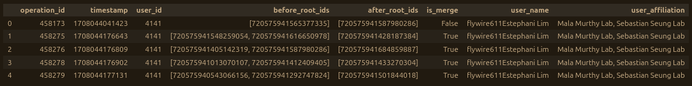

### get_seg_details
Gets the current segment ID, 3D volume in cubic micrometers, cable length in whatever units the datastack uses, and synapse count for each item in a list of segment IDs. Takes a datastack name as a string with the `datastack` argument and a list of segment IDs as integers with the `seg_ids` argument and returns a list of items. 

Each item of the output list is a list containing:
1. The original ID as an integer
2. The current ID as an integer
3. The volume in cubic micrometers as a float
4. The cable length in whatever units the datastack uses (usually nanometers) as a float
5. The number of outgoing synapses as an integer
6. The number of incoming synapses as an integer
7. The number of total synapses as an integer

If any step of the process encounters an error it will return a string value of `"ERROR"` for that step so as not to crash the entire run. Sometimes (e.g. when the problem is one of your connection to the server or some kind of host-side issue) rerunning will fix this, other times the problem wil always produce and error result. This can happen when a submitted segment is too large to pull all the data for at once (e.g the CT1 neurons in Drosophila) or you don't have permission to read from a specific datastack's CAVE tables.

Example:

```
# ----------------------------------------------------
# INPUT
# ----------------------------------------------------

import tracertools as tt

details_list = tt.get_seg_details(
    datastack="brain_and_nerve_cord",
    seg_ids=[
        720575941473274509,
        720575941524660200,
        720575941565377335,
    ],
)

print(details_list)

# ----------------------------------------------------
# OUTPUT
# ----------------------------------------------------

[
    [
        720575941473274509,
        720575941441350235,
        523.49226624,
        2453811.5,
        5893,
        945,
        6838
    ],
    [
        720575941524660200,
        720575941519923628,
        158.71888512,
        587790.9375,
        1614,
        257,
        1871
    ],
    [
        720575941565377335,
        720575941703820762,
        770.08292352,
        2826879.75,
        7469,
        1662,
        9131
    ]
]
```

> [!NOTE]
> The list output above has been formatted for ease of reading using the pretty-print Python module, which can be installed with `pip install pprint` and used by adding `from pprint import pprint` to your imports and replacing the `print()` command with `pprint()`. The actual default output would all be on a single line.

### get_seg_edits
Gets the tracer-format edit history for a given segment as a pandas DataFrame object. Takes a datastack name as a string with the `datastack` argument and a segment ID as an integer with the `seg_id` argument and returns a pandas DataFrame object where each row represents a single edit that was made in the history of the requested segment. Columns include:

1. "operation_id" - a unique number CAVE uses to identify each edit, useful for more detailed lookups
2. "is_merge" - a boolean (True/False) value denoting whether or not the edit was a merge (True = merge, False = split)
3. "point_coords" - a list of two 3-item lists of integers representing the point coordinates for each side of the edit. For merges these are the actual points the user chose, but in the case of splits, these are the average of all the points automatically generated by the cut tool. Thus, split coordinates may be a little bit less accurate than those for merges.
4. "before_segs" - a list of one (for splits) or two (for merges) segment IDs before the edit was made
5. "after_segs" - a list of one (for merges) or two (for splits) segment IDs after the edit was made
6. "seg_pair" - a list of two segment IDs that are either the pre-edit segments (for merges) or post-edit segments (for splits). Useful to have as a single category for certain analysis tasks like calculating supervoxel addition/subtraction sums (when paired with the "is_merge" column)
7. "user" - the unique number identifying which user made the edit. Useful for assigning credit when calculating user contributions in supervoxels to a given segment or blame when grumbling about terrible neuron-ruining edits

By default uses the standard `"operation_id"` column name of the CAVE operation detail table for the requested datastack when pulling backend data, but a different column name can be passed asa string with the `op_column` argument if the datastack you're working with uses another term.

Example:

```
# ----------------------------------------------------
# INPUT
# ----------------------------------------------------

import tracertools as tt

cl_df = tt.get_seg_edits(
    datastack="brain_and_nerve_cord",
    seg_id=720575941703820762,
)

cl_df.head()

# ----------------------------------------------------
# OUTPUT
# ----------------------------------------------------
```

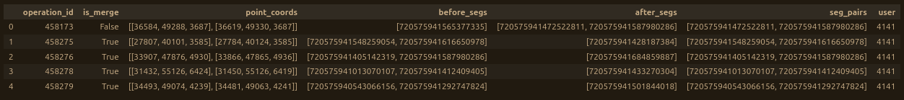

### get_seg_from_sv
Gets the current segment ID that a known supervoxel belongs to. Takes a datastack name as a string with the `datastack` argument and a supervoxel ID as an integer with the `sv_id` argument and returns the current segment ID that supervoxel belongs to as an integer.

Example:

```
# ----------------------------------------------------
# INPUT
# ----------------------------------------------------

import tracertools as tt

seg = tt.get_seg_from_sv(
    datastack="brain_and_nerve_cord",
    sv_id=76919154560765265,
)

print(seg)

# ----------------------------------------------------
# OUTPUT (as of 9 June 2026)
# ----------------------------------------------------

720575941703820762
```

### get_seg_skeletons
Gets a list of osteoid-format skeleton objects for a list of segment IDs. Takes a datastack name as a string with the `datastack` argument and a list of segment ID as integers with the `seg_ids` argument and returns a list of osteoid Skeleton objects. Will print the estimated time to skeletonize the submitted segments as calculated by the skeletonization service to give you a rough idea of how long it will take to run. Skeletons are cached once they're generated, so requesting the same skeleton more than once won't require recalculation and should be nearly instantaneous.

Example:

```
# ----------------------------------------------------
# INPUT
# ----------------------------------------------------

import tracertools as tt

skeletons = tt.get_seg_skeletons(
    datastack="brain_and_nerve_cord",
    seg_ids=[
        720575941473274509,
        720575941524660200,
        720575941565377335,
    ],
)

print(skeletons)

# ----------------------------------------------------
# OUTPUT
# ----------------------------------------------------

[
    Skeleton(
        segid=None, 
        vertices=(shape=274, float32), 
        edges=(shape=273, uint32), 
        radius=(274, float64), 
        vertex_types=(274, uint8), 
        space='physical', 
        transform=[
            [4.0, 0.0, 0.0, 0.0], 
            [0.0, 4.0, 0.0, 0.0], 
            [0.0, 0.0, 45.0, 0.0]
        ]
    ),
    Skeleton(
        segid=None, 
        vertices=(shape=99, float32), 
        edges=(shape=98, uint32), 
        radius=(99, float64), 
        vertex_types=(99, uint8), 
        space='physical', 
        transform=[
            [4.0, 0.0, 0.0, 0.0], 
            [0.0, 4.0, 0.0, 0.0], 
            [0.0, 0.0, 45.0, 0.0]
        ]
    ),
    Skeleton(
        segid=None, 
        vertices=(shape=505, float32), 
        edges=(shape=504, uint32), 
        radius=(505, float64), 
        vertex_types=(505, uint8), 
        space='physical', 
        transform=[
            [4.0, 0.0, 0.0, 0.0], 
            [0.0, 4.0, 0.0, 0.0], 
            [0.0, 0.0, 45.0, 0.0]
        ]
    )
]
```

> [!NOTE]
> The list output above has been formatted for ease of reading using a combination of the pretty-print Python module, which can be installed with `pip install pprint` and used by adding `from pprint import pprint` to your imports and replacing the `print()` command with `pprint()` and manual adjustment. The actual default output would all be on a single line.

### get_svs_from_seg
Gets a list of all the supervoxels associate with a segment. Takes a datastack name as a string with the `datastack` argument and a segment ID as an integer with the `seg_id` argument and returns a list of supervoxel IDs as integers.

Example:

```
# ----------------------------------------------------
# INPUT
# ----------------------------------------------------

import tracertools as tt

svs = tt.get_svs_from_seg(
    datastack="brain_and_nerve_cord",
    seg_id=720575941413124779,
)

print(svs)

# ----------------------------------------------------
# OUTPUT
# ----------------------------------------------------

[
    76492475061776745, 
    76492475061779442, 
    76492475061779424,
    ...
    76281162871835627, 
    76281162871832853, 
    76281162871835567
]
```

> [!NOTE]
> The above output is truncated. The actual list of all the supervoxels in this segment is 846,443 items long. This function may sometimes fail on extremely large segments (e.g. the CT1 cells in Drosophila). This is due to rate-limiting on requests to the backend servers that host the supervoxel information.

### get_supported_configs
Gets a list of the names of all the datastacks for which tracer-format configs exist. Not all configs have the same level of support. To view a datastack's config information, use the `get_config` function.

Example:

```
# ----------------------------------------------------
# INPUT
# ----------------------------------------------------

import tracertools as tt

configs = tt.get_supported_configs

print(configs)

# ----------------------------------------------------
# OUTPUT (as of 10 June 2026)
# ----------------------------------------------------

[
    "brain_and_nerve_cord",
    "flywire_fafb_production",
    "male_adult_nerve_cord",
    "stroeh_mouse_retina",
]
```

### gsheet_add_column
> [!IMPORTANT]
> Google-sheet-related functions require a bit of additional setup. Please read the [Google Sheet Functions](https://github.com/jaybgager/tracertools/tree/main#google-sheet-functions) section before use.

Adds the data from a Python list as a column to a tab in a google sheet. Each list item will fill a row in the first empty column of the chosen google sheet tab. Takes a Google sheet key as a string with the `sheet_key` argument, the name of a tab within that spreadsheet as a string with the `tab_name` argument, and a Python list with the `col_data` argument.

Example (using [this Google sheet](https://docs.google.com/spreadsheets/d/1AqIyrqSaEJFGD5Ff1fergwJ8-q0x2l0xCgO025C401c/edit?usp=sharing)):

Starting with a blank sheet...

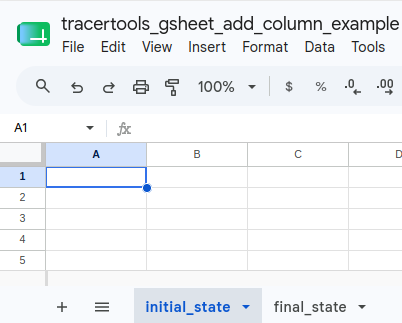

Running the code...

```
# ----------------------------------------------------
# INPUT
# ----------------------------------------------------

import tracertools as tt

tt.gsheet_add_column(
    sheet_key="1AqIyrqSaEJFGD5Ff1fergwJ8-q0x2l0xCgO025C401c",
    tab_name="final_state",
    col_data=[
        "segment",
        "720575941473274509",
        "720575941524660200",
        "720575941565377335",
    ],
)
```

You now have a filled-in sheet.

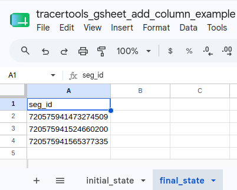

### gsheet_add_row
> [!IMPORTANT]
> Google-sheet-related functions require a bit of additional setup. Please read the [Google Sheet Functions](https://github.com/jaybgager/tracertools/tree/main#google-sheet-functions) section before use.

Adds the data from a Python list as a row to a tab in a google sheet. Each list item will fill a column in the first empty row of the chosen google sheet tab. Takes a Google sheet key as a string with the `sheet_key` argument, the name of a tab within that spreadsheet as a string with the `tab_name` argument, and a Python list with the `row_data` argument.

Example (using [this Google sheet](https://docs.google.com/spreadsheets/d/1KM0xY9-yLe5fwiQit8yrwcg7vbvPDlZMEUnxf1BeFns/edit?usp=sharing)):

Starting with a blank sheet...

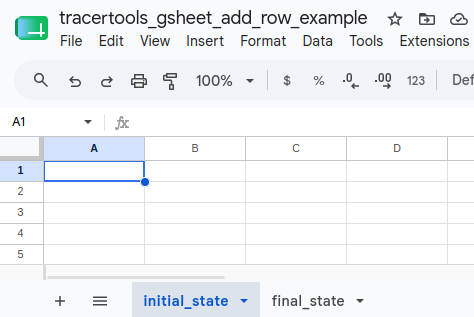

Running the code...

```
# ----------------------------------------------------
# INPUT
# ----------------------------------------------------

import tracertools as tt

tt.gsheet_add_row(
    sheet_key="1KM0xY9-yLe5fwiQit8yrwcg7vbvPDlZMEUnxf1BeFns",
    tab_name="final_state",
    row_data=[
        "segment",
        "3d_volume",
        "cable_length",
        "synapses",
    ],
)
```

You now have a filled-in sheet.

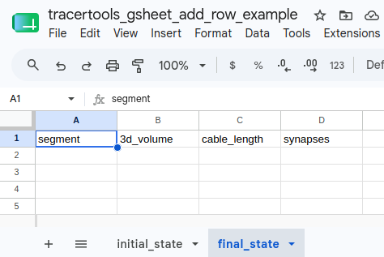

### gsheet_add_seg_details
> [!IMPORTANT]
> Google-sheet-related functions require a bit of additional setup. Please read the [Google Sheet Functions](https://github.com/jaybgager/tracertools/tree/main#google-sheet-functions) section before use.

Gets neuron details for a list of segment IDs in a Google sheet column and adds them to the sheet. Requires a tab in the sheet with a single column of segment IDs with a header. Takes a datastack name as a string with the `datastack` argument, a Google sheet key as a string with the `sheet_key` argument, and a tab name as a string with the `tab_name` argument.

By default, adds columns for 3d volume, cable length, synapse counts, and proofreading status. Each of these can be turned off independently by setting the `volume`, `cable_length`, `synapse_counts`, or `proofreading` arguments to `False`.

Returns `"ERROR"` string if a particular lookup process encounters a problem to avoid crashing the whole run. In some cases, like connection or server-side issues, waiting a bit and rerunning can fix this. In others, like cases where a segment is too large for the requested lookup (e.g. the CT1 neurons in Drosophila) or the initial ID is bad, rerunning won't work.

Example (using [this Google sheet](https://docs.google.com/spreadsheets/d/1Mq93HT7iEv-E1-4NCN9_bcMIGzbTVC9A0S5ZqYr4VAg/edit?usp=sharing)):

Starting with a headered column of segment IDs...

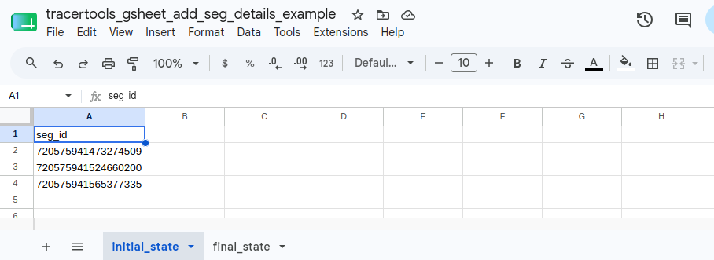

Running the code...

```
# ----------------------------------------------------
# INPUT
# ----------------------------------------------------

import tracertools as tt

tt.gsheet_add_seg_details(
    datastack="brain_and_nerve_cord",
    sheet_key="1Mq93HT7iEv-E1-4NCN9_bcMIGzbTVC9A0S5ZqYr4VAg",
    tab_name="final_state",
)
```

You now have a filled-in sheet.

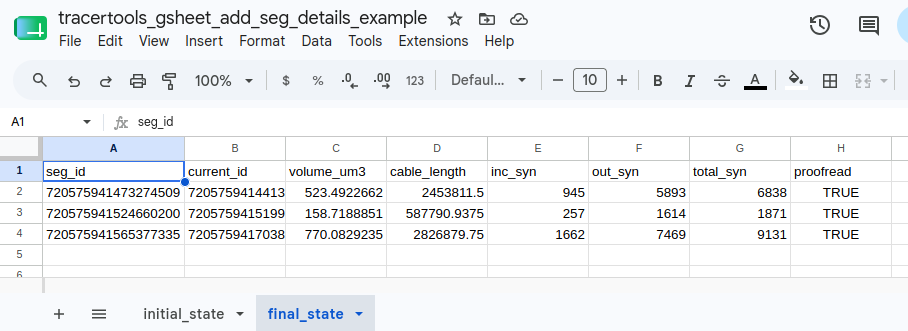

>[!NOTE]
>This function writes one row at a time to allow for continuous monitoring for issues when running very large lists. The amount of time required for each segment's lookup processes varies with segment size, synapse number, and connection speed to the host servers. In particular getting the cable length requires skeletonizing the segments, which can take a minute or two per segment depending on size and whther that skeleton has already been cached recently. Time estimates for each segment will print out as they're fed into the skeletonization service. On average, a good starting point is to budget 20-30 seconds for each segment to run.

### gsheet_get_col_as_list
> [!IMPORTANT]
> Google-sheet-related functions require a bit of additional setup. Please read the [Google Sheet Functions](https://github.com/jaybgager/tracertools/tree/main#google-sheet-functions) section before use.

Gets the data of a Google sheet column as a python list. Takes a sheet key as a string with the `sheet_key` argument and a tab name as a string with the `tab_name` argument and returns a list of whatever values were in the requested column.

By default this returns the first column (column A), but any column can be chosen by setting the `col_num` argument to the column's number. Google sheets start column numbering at 1 (e.g. A = 1, B = 2, ...).

If you want to ignore the first row (e.g. you don't need a column's header), you can set the `ignore_header` argument to `True`.

Examples (using [this Google sheet](https://docs.google.com/spreadsheets/d/1Qvm6AVyd2zI7BRTHrvJOM_-QvI3vR3qW9pW3_WucGsc/edit?usp=sharing)):

Starting with a sheet of segment info...

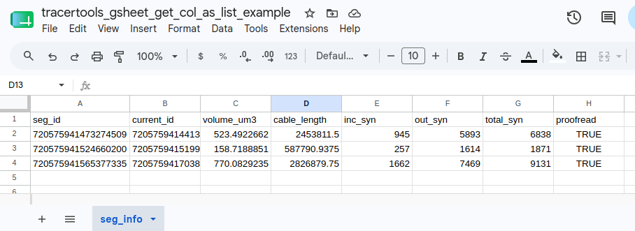

```
# ----------------------------------------------------
# INPUT
# ----------------------------------------------------

import tracertools as tt

col_data = tt.gsheet_get_col_as_list(
    sheet_key="1Qvm6AVyd2zI7BRTHrvJOM_-QvI3vR3qW9pW3_WucGsc",
    tab_name="seg_info",
)

print(col_data)

# ----------------------------------------------------
# OUTPUT
# ----------------------------------------------------

[
    'seg_id', 
    '720575941473274509', 
    '720575941524660200', 
    '720575941565377335'
]
```

Example (picking a different column):

```
# ----------------------------------------------------
# INPUT
# ----------------------------------------------------

import tracertools as tt

col_data = tt.gsheet_get_col_as_list(
    sheet_key="1Qvm6AVyd2zI7BRTHrvJOM_-QvI3vR3qW9pW3_WucGsc",
    tab_name="seg_info",
    col_num=4,
)

print(col_data)

# ----------------------------------------------------
# OUTPUT
# ----------------------------------------------------

[
    'cable_length', 
    '2453811.5', 
    '587790.9375', 
    '2826879.75'
]
```

Example (ignoring first row):

```
# ----------------------------------------------------
# INPUT
# ----------------------------------------------------

import tracertools as tt

col_data = tt.gsheet_get_col_as_list(
    sheet_key="1Qvm6AVyd2zI7BRTHrvJOM_-QvI3vR3qW9pW3_WucGsc",
    tab_name="seg_info",
    ignore_header=True,
)

print(col_data)

# ----------------------------------------------------
# OUTPUT
# ----------------------------------------------------

[
    '720575941473274509', 
    '720575941524660200', 
    '720575941565377335'
]
```

### gsheet_get_tab_as_df
> [!IMPORTANT]
> Google-sheet-related functions require a bit of additional setup. Please read the [Google Sheet Functions](https://github.com/jaybgager/tracertools/tree/main#google-sheet-functions) section before use.

Gets all the data from a google sheet tab as a dataframe. Takes a sheet key as a string with the `sheet_key` argument and a tab name as a string with the `tab_name` argument and returns a pandas DataFrame object containing all the data in the tab.

By default, assumes first row of data are headers that should be used for DataFrame column names. If this isn't the case, you can set the `has_headers` argument to `False`. Doing so will treat the first row of values the same as all the others and automatically generate DataFrame column names using the pattern `col_1, col_2, ..., col_n`.

Example (using [this Google sheet](https://docs.google.com/spreadsheets/d/1Z6n5bRPx4wqfIDR4ZwUJl3-z2esScgxfLOeXzri2lOw/edit?usp=sharing)):

Starting with a sheet of segment info...

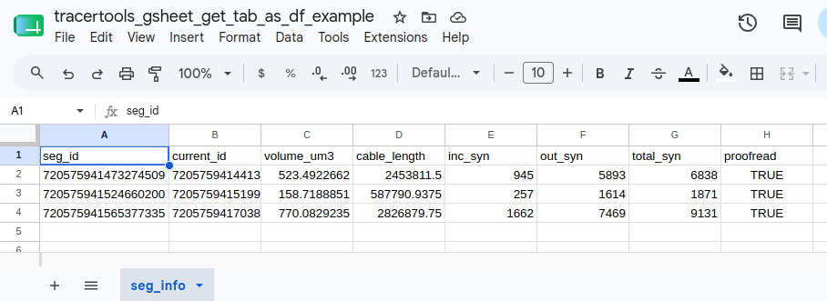

```
# ----------------------------------------------------
# INPUT
# ----------------------------------------------------

import tracertools as tt

tab_df = tt.gsheet_get_tab_as_df(
    sheet_key="1Z6n5bRPx4wqfIDR4ZwUJl3-z2esScgxfLOeXzri2lOw",
    tab_name="seg_info",
)

tab_df.head()

# ----------------------------------------------------
# OUTPUT
# ----------------------------------------------------
```

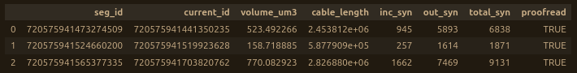

Example (ignoring the first row):

```
# ----------------------------------------------------
# INPUT
# ----------------------------------------------------

import tracertools as tt

tab_df = tt.gsheet_get_tab_as_df(
    sheet_key="1Z6n5bRPx4wqfIDR4ZwUJl3-z2esScgxfLOeXzri2lOw",
    tab_name="seg_info",
    has_headers=False,
)

tab_df.head()

# ----------------------------------------------------
# OUTPUT
# ----------------------------------------------------
```

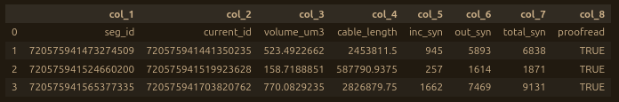

### host_ng_volume_locally
Locally hosts a precomputed neuroglancer volume for testing purposes. Takes the absolute file path to the location where the top-level folder of the volume is stored on your local machine as a string with the `volume_path` argument.

Example (using a hypothetical local volume called `image01` stored in the `/home/user/ng_volumes/` folder):

First you run the code to start the local host...

```
# ----------------------------------------------------
# INPUT
# ----------------------------------------------------

import tracertools as tt

tt.host_ng_volume_locally(
    volume_path="home/user/ng_volumes/image01"
)

# ----------------------------------------------------
# OUTPUT
# ----------------------------------------------------

Neuroglancer server listening to http://localhost:1337
```

This script will continue hosting the volume as long as it's running. When you want to stop hosting, stop the script.

Then you can open a neuroglancer instance in your browser of choice and create a new layer by clicking the `+` button to the right of the last current layer in the layer bar.

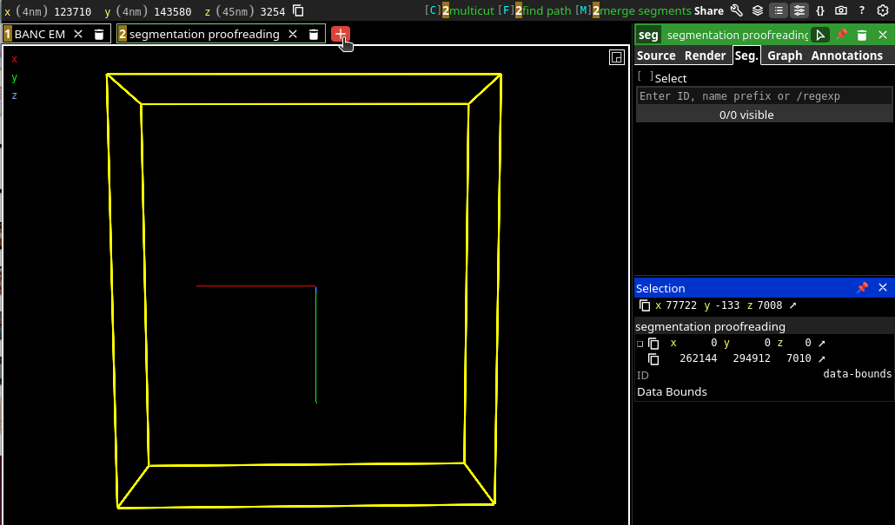

You should then be propted to enter a `Data Source URL` at the top of the `Source` tab of the `new layer` menu on the right side of the neuroglancer window, as shown below.

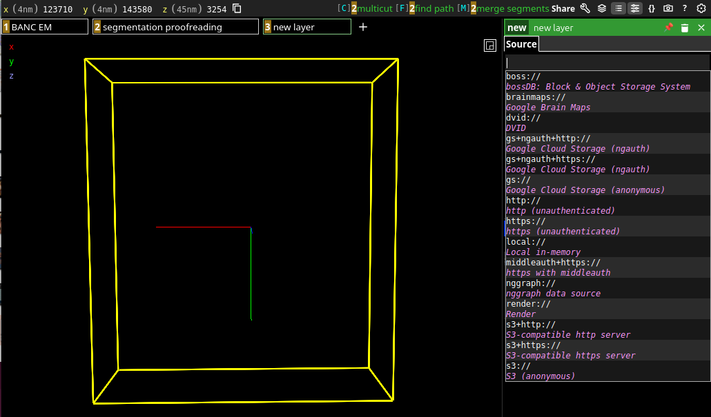

Into the field, paste `http://localhost:1337/|neuroglancer-precomputed:` and hit Enter. You should see a pale yellow bar appear that says `Create as segmentation layer`. Click this.

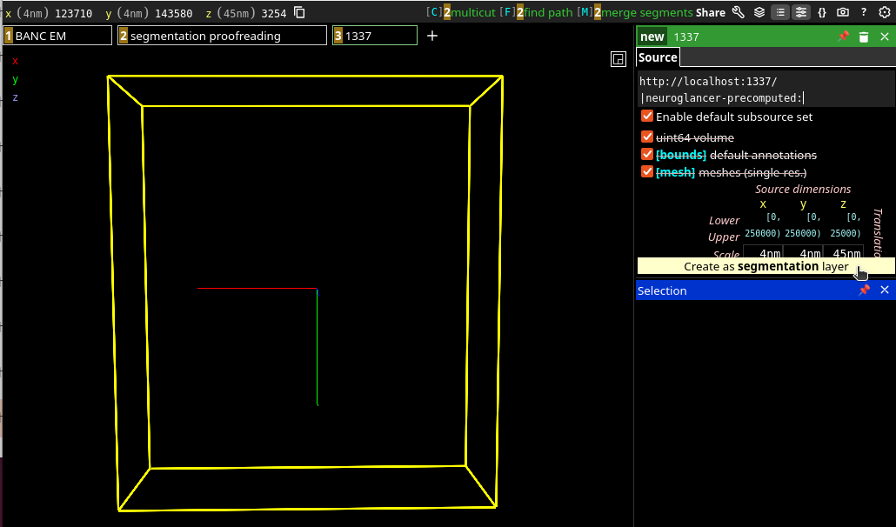

Once you click the pale yellow bar, it should create a segmentation layer named `1337`. Depending on the volume's default settings, this may bring up a yellow bounding box that can be turned off by unchecking the `[bounds] default annotations` option in the `Source` tab of the `seg` menu on the right.

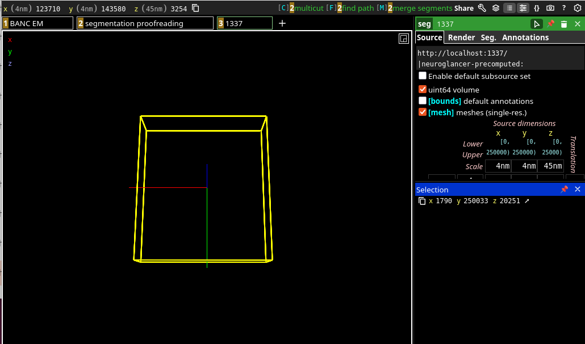

If you've used one of the functions in this package to create a mesh and/or volume that you're hosting, it likely has a single segment labeled `1` that's turned off by default. To turn this on, go to the `Seg.` tab of the `seg` menu on the right, type `1` into the input field, and hit Enter. Your mesh should show up (probably as a cornflower blue color, which is the default).

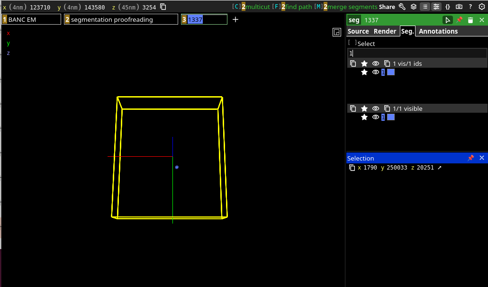

>[!WARNING]
>This function doesn't work with older versions of neuroglancer that don't allow http hosting, like Flywire.

>[!WARNING]
>This function is effectively impossible to use on Windows machines when working with legacy-format neuroglancer volumes containing single-resolution unsharded meshes, as these require several files to have colons `:` in their filenames, a practice forbidden by the Windows OS. If you've downloaded such a volume on Windows using the functions in this package, a stopgap measure has been applied which converts colons to triple-underscores `___` in file names. While this allows volumes to be passed to and from Windows machines, it doesn't allow for local hosting, as the host software requires the colons.

>[!NOTE]
>If the `volume_path` passed doesn't begin with a slash `/` (e.g. `home/user/...` instead of `/home/user/...`), this function will assume you want to add the passed path to the path to the current directory you're sitting in when you call this function instead of starting at your machine's root directory. You can run this either way if you format the path properly, but should be aware of the behavior if you're getting errors related to the `volume_path`.

### make_edits_link
Generates a neuroglancer link showing all the edits for a given segment as line annotations. Also contains the current segmentation in cyan and the largest original segment in its lineage in red, with 3D opacity adjusted to 0.99.

These settings cause overlap between the largest original segment and the current segment to turn grey, showing what's remained unchanged. They also cause pieces added to display cyan and pieces removed to display red for ease of analysis.

Takes a datastack name as a string with the `datastack` argument and a segment ID as an integer with the `seg_id` argument and returns a neuroglancer url as a string.

Example:

```
# ----------------------------------------------------
# INPUT
# ----------------------------------------------------

import tracertools as tt

edits_link = tt.make_edits_link(
    datastack="brain_and_nerve_cord",
    seg_id=720575941515375171,
)

print(edits_link)

# ----------------------------------------------------
# OUTPUT
# ----------------------------------------------------

https://spelunker.cave-explorer.org/#!middleauth+https://global.daf-apis.com/nglstate/api/v1/5297316780048384
```

>[!NOTE]
>While the coordinates of the merge edits represent the exact locations laid down by the proofreader, the split point coordinates represent an average of all the individual coordinates generated by the automated cut tool, and so may be slightly distorted in some cases.

### make_local_volume_from_obj
Locally generates a legacy-format neuroglancer volume that contains a single-resolution unsharded precomputed mesh using an OBJ file. Takes a datastack name as a string with the `datastack` argument, the absolute file path to the existing OBJ file as a string with the `obj_path` argument, and the absolute path to the folder where you want the volume to be stored as a string with the `output_path` argument. A folder called "image" containing the volume files will be created in this folder.

>[!WARNING]
>This function doesn't work on Windows OS due to the volume format requiring colons `:` in several file names, which is prohibited on Windows. Currently there's no way around this limitation.

Example:

```
# ----------------------------------------------------
# INPUT
# ----------------------------------------------------

import tracertools as tt

tt.make_local_volume_from_obj(
    datastack="brain_and_nerve_cord",
    obj_path="/home/user/path/to/file.obj",
    output_path="/home/user/path/to/volume/folder"
)
```

This would create a `brain_and_nerve_cord` volume folder named `image` that contained all the volume files in the `/home/user/path/to/volume/folder` folder using the data from `file.obj`.

### make_mesh_from_points
>[!WARNING]
>This function is experimental and may break easily. It currently only works with the Princeton nokura bucket.

Generates a bucket-hosted legacy-format neuroglancer volume containing a precomputed single-resolution unsharded mesh from a neuroglancer state shortlink containing point annotation layers and returns a shortlink to a neuroglancer state with the mesh selected in a segmentation layer. Takes a datastack name as a string with the `datastack` argument, a neuroglancer shortlink as a string with the `share_url` argument, and the absolute path to where you want to host the volume on a bucket as a string with the `bucket_path` argument and returns a shortlink url as a string 

>[!NOTE]
>The last folder name in the bucket path will be the top-level folder of the volume. E.g. if your bucket path is "my://bucket/path/vol_01" the vol_01 folder will be the neuroglancer volume. This will create new folders where none exist if you add them into the path.

Before explaining the optional parameters for this function, it's a good idea to understand how it works. If all we wanted was a [convex hull](https://en.wikipedia.org/wiki/Convex_hull), this would be simple to generate. Convex hulls are created by connecting the outermost points in a cloud and ignoring everything inside. This is fine for many purposes, but often you'll need to be able to make more detailed shapes that include concave regions. Doing this automatically, however, becomes complicated very quickly. Take the diagram below for example:

<p align="center">
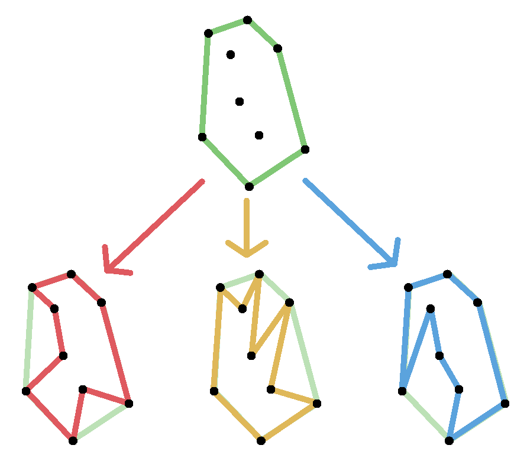
</p>

If we start with the black point cloud, we can easily generate the green convex hull at the top. However, if we want to include concavities, the computer doesn't know exactly which of the many possible "legitimate" configurations of point connections to use. All three of the shapes on the bottom row are legitimate possible ways of connecting the point cloud into a concave shape. The problem is even more difficult when you add a third spatial dimension.

To solve this issue, we can use a process called [Delaunay Triangulation](https://en.wikipedia.org/wiki/Delaunay_triangulation), or more specifically, a modified version of it that produces a structure called an [alpha shape](https://en.wikipedia.org/wiki/Alpha_shape). Without going into the math too much, Delaunay Triangulation connects points into triangles in a way so that each triangle's [circumcircle](https://en.wikipedia.org/wiki/Circumcircle) (the circle on which all three points that make up the triangle lie) doesn't have any points within it. The process works very similarly in 3D except that instead of making triangles by fitting 3 points to a circle, it makes tetrahedrons by fitting 4 points to a sphere. See the diagram below for a 2D visualization of the result (ignore the red dots, those are just the centerpoints of the circles):

<p align="center">
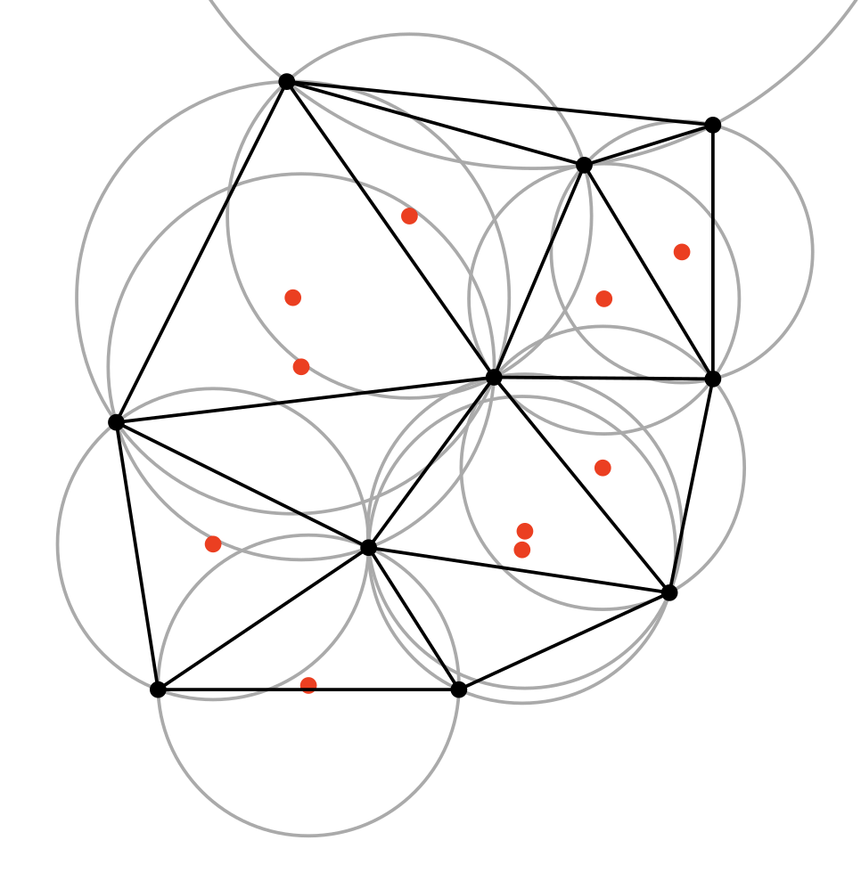
</p>

Above image derived from [public domain work on Wikipedia](https://commons.wikimedia.org/wiki/File:Delaunay_circumcircles_centers.svg) by user [Nü](https://es.wikipedia.org/wiki/Usuario:N%C3%BC)

The alpha shape technique then takes this result and removes all the triangles too large to fit into a circle of a specified size. The radius of this circle is called the "alpha" value. A smaller alpha value will produce a more detailed final result, but risks breaking apart points in a way that creates holes in the output. See the example below for a visualization*:

<p align="center">
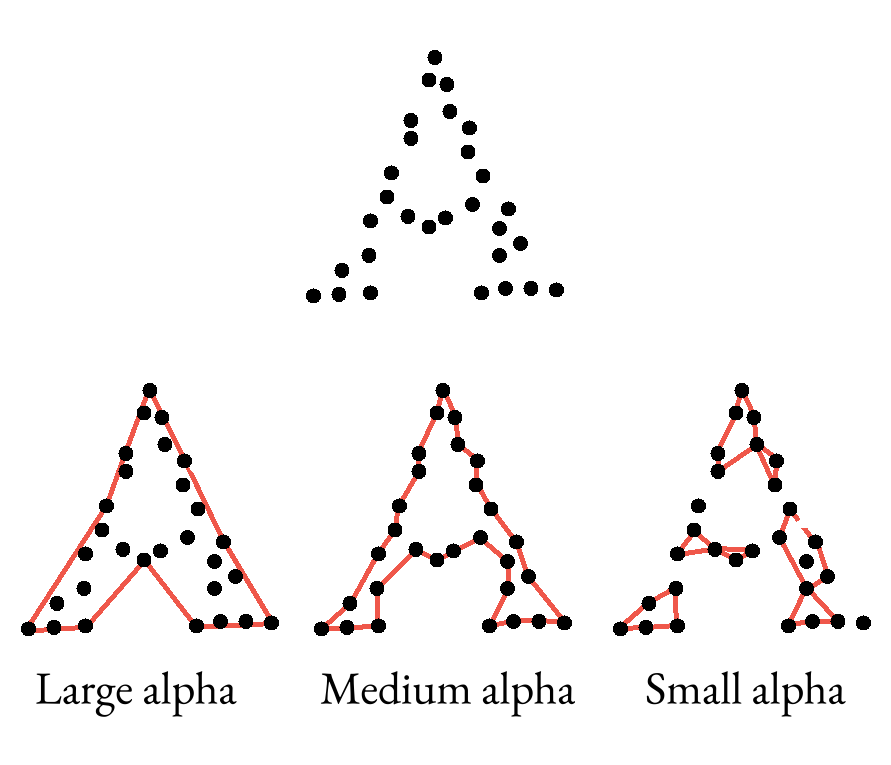
</p>

*This is only showing what the exterior hull of the final shape would look like, the actual triangles aren't drawn. This is also a hand-drawn example, so there may be some slight spatial inaccuracies since it's not generated from actual data.

Trying different alpha values for the same point cloud is therefore often necessary to produce a good final product. This function starts at an alpha of 0 by default, then uses some math to guess at a good interval to use, and tries incrementing the alpha value up by that interval with each pass until it hits a mesh that's "watertight" (one that doesn't have any holes in it). It does this for each of the point annotation layers in the initial neuroglancer link, then fuses all the resulting meshes together using a manifold3d boolean union method.

This often works pretty well, but you may want to manually try other starting alpha values. For this reason, you can specify your own by passing a list of alpha values as integers or floats with the `alphas` argument. You must pass one alpha value for each point annotation layer in your submitted neuroglancer link. If you pass a None value for one of the alphas, the function will use the default automated process for that annotation layer.

If you don't want to use this iterative process and simply want to use a specific, hardcoded alpha value, you can set the `auto_grow` argument to `False`. In order to see what the final alpha valeus were for each mesh, you can set the `print_alphas` argument to `True`.

This function also offers the optional ability to save all the individual layer meshes, as well as the final combined mesh, as OBJ files by setting the `save_objs` argument to `True` and optionally passing the absolute file path to the directory where you want them saved as a string with the `obj_path` argument (otherwise it tries to put them in your default Downloads folder if one exists). These OBJ files are often useful for manual manipulation of the meshes in a program like [Blender](https://www.blender.org).

Example:

```
# ----------------------------------------------------
# INPUT
# ----------------------------------------------------

import tracertools as tt

mesh_url = tt.make_mesh_from_points(
    datastack="brain_and_nerve_cord",
    share_url="https://spelunker.cave-explorer.org/#!middleauth+https://global.daf-apis.com/nglstate/api/v1/5892489557835776",
    bucket_path="path://to/your/bucket/here", # replace this with the path to your bucket folder #
)

print(mesh_url)

# ----------------------------------------------------
# OUTPUT
# ----------------------------------------------------

https://spelunker.cave-explorer.org/#!middleauth+https://global.daf-apis.com/nglstate/api/v1/6048239164850176
```

Example (with alpha setting and printing):

```
# ----------------------------------------------------
# INPUT
# ----------------------------------------------------

import tracertools as tt

mesh_url = tt.make_mesh_from_points(
    datastack="brain_and_nerve_cord",
    share_url="https://spelunker.cave-explorer.org/#!middleauth+https://global.daf-apis.com/nglstate/api/v1/5892489557835776",
    bucket_path="path://to/your/bucket/here", # replace this with the path to your bucket folder #
    alphas=[
        100,
        None,
        None
    ],
    print_alphas=True,
)

print(mesh_url)

# ----------------------------------------------------
# OUTPUT
# ----------------------------------------------------

Submesh 1 alpha value 100 to 12974.6337890625
Submesh 2 alpha value None to 12170.793301100999
Submesh 3 alpha value None to 8147.412370933395
https://spelunker.cave-explorer.org/#!middleauth+https://global.daf-apis.com/nglstate/api/v1/6163250470191104
```

**Iterative mesh refinement:**

If you want to fine-tune a mesh to tighten it up, the best way to do it is to set up two blocks of code in a jupyter notebook. The first one can use the name `best` for the mesh volume. This example uses an initial neuroglancer state with three point annotation layers.

```
import tracertools as tt

mesh_url = tt.make_mesh_from_points(
    datastack="brain_and_nerve_cord",
    share_url="https://spelunker.cave-explorer.org/#!middleauth+https://global.daf-apis.com/nglstate/api/v1/5892489557835776",
    bucket_path="path://to/your/bucket/here/best", # replace this with the path to your bucket folder #
    alphas=[
        None,
        None,
        None
    ],
    print_alphas=True,
)

print(mesh_url)
```

To start with, run the mesher using None values for all the layers for this "best" volume" to get the default result, which should look something like this:

```
Submesh 1 alpha value None to 14386.499164255525
Submesh 2 alpha value None to 12170.793301100999
Submesh 3 alpha value None to 8147.412370933395
https://spelunker.cave-explorer.org/#!middleauth+https://global.daf-apis.com/nglstate/api/v1/5700829091725312
```

Open the neuroglancer link. Change the name of the mesh layer to `best` and change the color to something that will contrast with your test mesh ( #C061CB is a good choice to contrast with the default green color #6DB86B the mesher generates, but do whatever works for you).

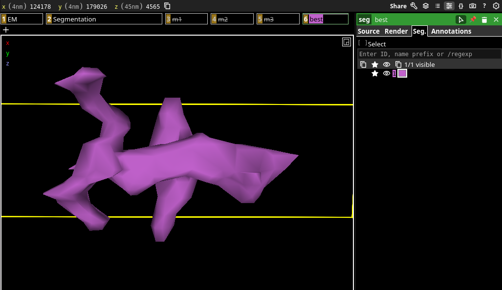

The second code block should be set up the same as the first, but with the name `test` for the last folder in the bucket volume path. You can then manually adjust one of the alpha values to get a potentially different output:

```
import tracertools as tt

mesh_url = tt.make_mesh_from_points(
    datastack="brain_and_nerve_cord",
    share_url="https://spelunker.cave-explorer.org/#!middleauth+https://global.daf-apis.com/nglstate/api/v1/5892489557835776",
    bucket_path="path://to/your/bucket/here/test", # replace this with the path to your bucket folder #
    alphas=[
        None,
        None,
        None
    ],
    print_alphas=True,
)

print(mesh_url)
```

This should give you something like the following output:

```
Submesh 1 alpha value 100 to 12974.6337890625
Submesh 2 alpha value None to 12170.793301100999
Submesh 3 alpha value None to 8147.412370933395
https://spelunker.cave-explorer.org/#!middleauth+https://global.daf-apis.com/nglstate/api/v1/4632690690097152
```

As you can see, the final alpha value for the first submesh is different now, having started at a higher initial value of 100 instead of 0. Open the output link and copy the text in the top field of the `source` tab:

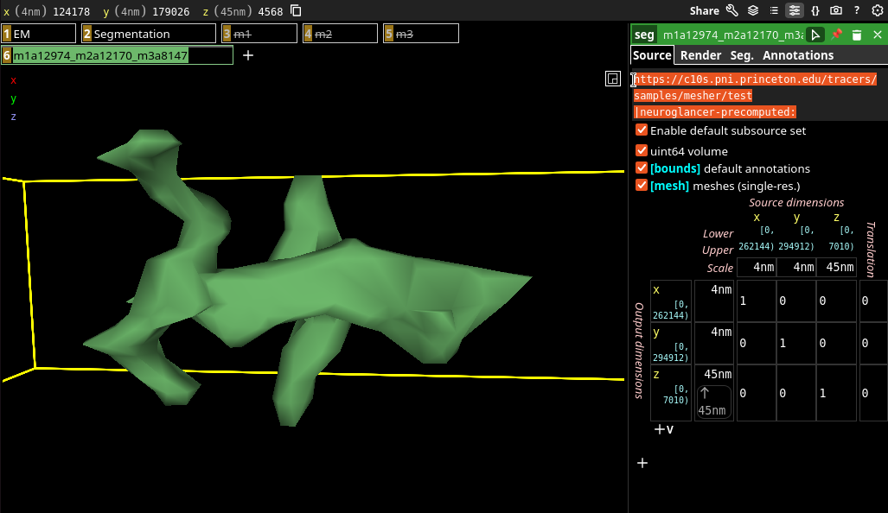

Go back to the previous neuroglancer window with your `best` segmentation layer in it and create a new layer by clicking the `+` button to the right of the `best` layer in the layers bar. Paste the string you copied from the test mesh window into the input field of the `source` tab on the right side menu and hit enter. A pale yellow bar should appear at the bottom-right that says `Create as segmentation layer`. Click that to create the layer, then rename the layer "test", like so:

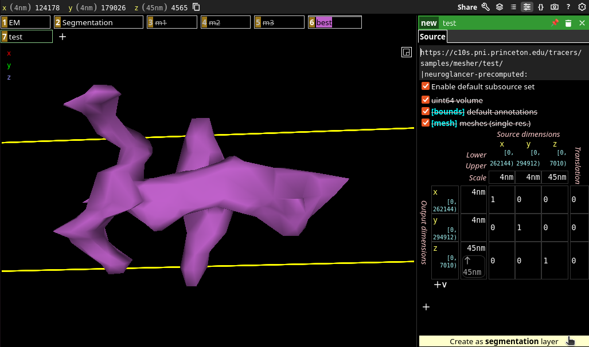

Right-click the test layer to select it and turn on segment `1` by entering that into the input field of the `Seg.` tab of the right-side menu and hitting Enter. Change the color to something that contrasts with your `best` mesh (although the default mesher color is #6DB86B, it will likely be blue by default since you're loading it directly from the host server). As a quicker alternative to doing this manually, you may be able to simply drag and drop the `test` mesh layer from its original neuroglancer window directly into the window with the `best` mesh layer.

If everything worked as planned, you should now see your `test` mesh overlapping with your `best` mesh. If the test mesh is indeed a tighter fit, there should be some areas of the `best` mesh clipping through it, like the purple bit in the image below. You may need to turn the `best` mesh off and on again to get this effect to render properly, as overlapping meshes sometimes behave inconsistently when rendered.


If your `test` mesh is better than your `best` mesh, go back to your first code block and replace the alpha values with the ones from the `test` block, then run the code again to overwrite the previous `best` with this newer, tighter, mesh. Then try another tweak to the alpha values for the `test` block and run that as well to replace the previous `test` mesh with this new one, like so:

```
# ----------------------------------------------------
# BEST BLOCK
# ----------------------------------------------------

import tracertools as tt

mesh_url = tt.make_mesh_from_points(
    datastack="brain_and_nerve_cord",
    share_url="https://spelunker.cave-explorer.org/#!middleauth+https://global.daf-apis.com/nglstate/api/v1/5892489557835776",
    bucket_path="nokura://tracers/samples/mesher/best", # replace this with the path to your bucket folder #
    print_alphas=True,
    alphas=[
        100,
        None,
        None
    ],
)

print(mesh_url)
```

```
# ----------------------------------------------------
# TEST BLOCK
# ----------------------------------------------------

import tracertools as tt

mesh_url = tt.make_mesh_from_points(
    datastack="brain_and_nerve_cord",
    share_url="https://spelunker.cave-explorer.org/#!middleauth+https://global.daf-apis.com/nglstate/api/v1/5892489557835776",
    bucket_path="nokura://tracers/samples/mesher/test", # replace this with the path to your bucket folder #
    alphas=[
        200,
        None,
        None
    ],
    print_alphas=True,
)

print(mesh_url)
```

By overwriting the old meshes, you change what data is stored at that address without actually changing the url you need to access it. This means you can simply refresh your neuroglancer window with the overlapping meshes and both your `best` and `test` meshes will reflect the changes you made. 

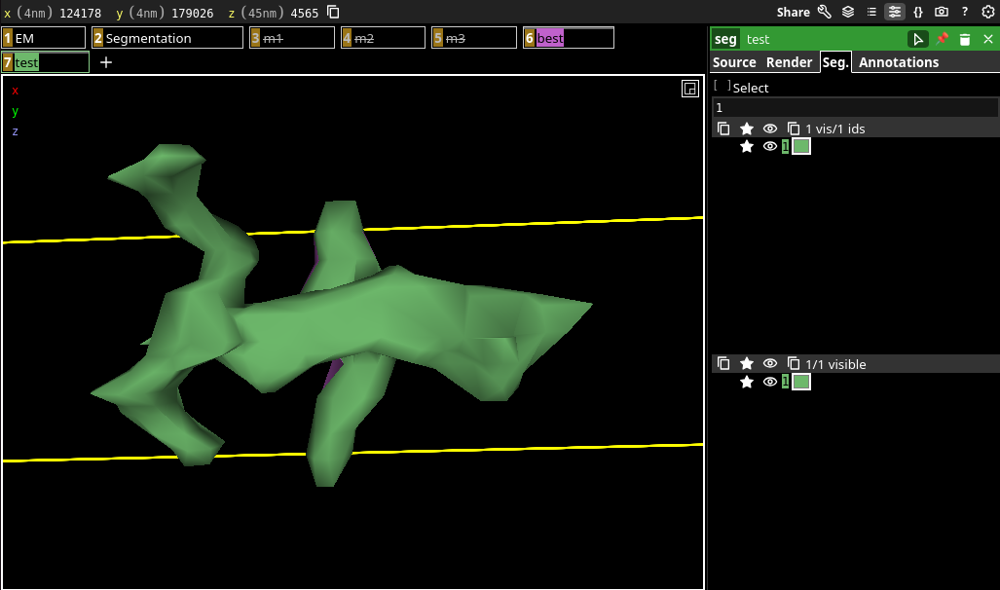

Keep repeating this process until you can't tighten up the `test` mesh any further, then move on to the next annotation layer and do the process again. Keep going until you've tightened up all the annotation layers as much as you can and you should have a nice, snug, watertight mesh for whatever your needs may be!

### make_ng_link
Generates a neuroglancer link from a datastack name, optionally adding a list of segment IDs and various layers. Only works on config-supported datastacks. Takes a datastack name as a string with the `datastack` argument and returns a string-format neuroglancer link to a state with the chosen datastack's image and segmentation layers.

Optionally pass segment IDs as a list of integers with the `seg_ids` argument to have them selected.

Optionally pass annotation layers as a list of dictionaries with the `anno_layers` argument. These can be created using the `make_anno_layer` function or constructed manually as long as the formatting is correct for the chosen datastack.

Optionally add a layer for the default region mesh(es) for the datastack if one exists by setting the `region_meshes` argument to `True`.

Optionally choose the coloration of selected segments by passing a list of string-format hexadecimal values with the `seg_colors` argument (e.g. `["#FF0000","#00FF00","#0000FF"]`). The length of this list must match the length of the list passed with `seg_ids`.

Optionally set the viewer site manually by passing a string of the base viewer url with the `viewer_site` argument. By default this function uses the default viewer site recommended by the datastack.

Optionally add a custom mesh layer by passing the url to a hosted volume with one or more meshes in it as a string with the `cutom_mesh_source` argument. Currently only designed to work with lecagy-format volumes containing precomputed single-resolution unsharded meshes. Use with other formats may work, but isn't guaranteed. Currently only one custom mesh can be passed,but multiple inputs are planned for the future. By default this mesh layer will be named "Custom Mesh" unless a custom name is passed as a string with the `custom_mesh_name` argument. Similarly, the default behavior makes the mesh segment ID 1 green `"#6DB86B"` unless a custom hexadecimal color value is passed as a string with the `custom_mesh_color` argument. This will only color the mesh segment with ID `1` currently. 

Optionally pass custom point coordinates as a list of integers with the `view_coords` argument. By default the standard coordinates for the chosen datastack config will be used (usually near the center of the volume). These coordinates must be in the same voxel resolution as the viewer used (e.g. `[4,4,45]` for `brain_and_nerve_cord`)

Optionally return a standard-format long neuroglancer url containing all the state information in i by setting the `long_url` argument to `True`. Default behavior uses the standard link shortening service for the chosen datastack, which dramatically reduces the character count of the links for use with common messaging services that impose character limits. 

Optionally set the opacity of the 3D viewer to 0.99 to make the meshes translucent by setting the `translucent_seg` argument to `True`. This is useful for comparing two versions of the same segment by setting them to complimentary colors (e.g. red `"#FF0000"` for the old trace and cyan `"#00FFFF"` for the new one), causing the overlap (i.e. the regions the two traces share) to turn neutral grey. This highlights changes made - in the previous example removed regions would show up red and added regions as cyan.

Example (basic behavior):

```
# ----------------------------------------------------
# INPUT
# ----------------------------------------------------

import tracertools as tt

ng_url = tt.make_ng_link(
    datastack="brain_and_nerve_cord",
    seg_ids=[
        720575941441350235,
        720575941519923628,
        720575941703820762,
    ],
    region_meshes=True,
)

print(ng_url)

# ----------------------------------------------------
# OUTPUT (as of 16 June 2026)
# ----------------------------------------------------

https://spelunker.cave-explorer.org/#!middleauth+https://global.daf-apis.com/nglstate/api/v1/6639015473184768
```

Example (custom colors, translucency):

```
# ----------------------------------------------------
# INPUT
# ----------------------------------------------------

import tracertools as tt

ng_url = tt.make_ng_link(
    datastack="brain_and_nerve_cord",
    seg_ids=[
        720575941473274509, # outdated version of 720575941441350235 #
        720575941524660200, # outdated version of 720575941519923628 #
        720575941565377335, # outdated version of 720575941703820762 #
        720575941441350235,
        720575941519923628,
        720575941703820762,
    ],
    seg_colors=[
        "#FF0000",
        "#FF0000",
        "#FF0000",
        "#00FFFF",
        "#00FFFF",
        "#00FFFF",
    ],
    translucent_seg=True,
)

print(ng_url)

# ----------------------------------------------------
# OUTPUT (as of 16 June 2026)
# ----------------------------------------------------

https://spelunker.cave-explorer.org/#!middleauth+https://global.daf-apis.com/nglstate/api/v1/5192707382181888
```

Example (custom mesh with chosen color and name, manual viewpoint setting):

```
# ----------------------------------------------------
# INPUT
# ----------------------------------------------------

import tracertools as tt

ng_url = tt.make_ng_link(
    datastack="brain_and_nerve_cord",
    custom_mesh_source="https://c10s.pni.princeton.edu/tracers/samples/mesher/volume_02|neuroglancer-precomputed:",
    custom_mesh_name="Orange you glad you can customize mesh names?",
    custom_mesh_color="#FF7800",
    view_coords=[123757, 180557, 4582],
)

print(ng_url)

# ----------------------------------------------------
# OUTPUT (as of 16 June 2026)
# ----------------------------------------------------

https://spelunker.cave-explorer.org/#!middleauth+https://global.daf-apis.com/nglstate/api/v1/4819158423306240
```

### make_objs_from_state_file
Generates convex hull meshes as OBJ files from all the point annotation layers in a local neuroglancer JSON state file. Takes a datastack name as a string with the `datastack` argument, the absolute file path to the existing JSON state file as a string with the `json_path` argument, and the absolute path to the folder where you want the OBJ files to be stored as a string with the `output_path` argument. The OBJ file names will be the same as the layers they were created from.

Example:

```
# ----------------------------------------------------
# INPUT
# ----------------------------------------------------

import tracertools as tt

tt.make_objs_from_state_file(
    datastack="brain_and_nerve_cord",
    json_path="/home/user/path/to/state.json",
    output_path="/home/user/path/to/obj/folder",
)
```

### make_point_cloud_from_state_file
Generates a point cloud as an OBJ file from a point annotation layer in a local neuroglancer JSON state file. Takes a datastack name as a string with the `datastack` argument, the absolute file path to the existing JSON state file as a string with the `json_path` argument, the name of the point annotation layer in the state to pull the coordinates from as a string with the `layer_name` argument, and the absolute path to the folder where you want the OBJ files to be stored as a string with the `output_path` argument. 

Example:

```
# ----------------------------------------------------
# INPUT
# ----------------------------------------------------

import tracertools as tt

tt.make_point_cloud_from_state_file(
    datastack="brain_and_nerve_cord",
    json_path="/home/user/path/to/state.json",
    layer_name="annotation1",
    output_path="/home/user/path/to/obj/folder",
)
```

### make_volume_mesh_from_state_file
Locally generates a precomputed single-res unsharded convex hull mesh in a legacy-format neuroglancer volume from a point annotation layer in a local neuroglancer JSON state file. Takes a datastack name as a string with the `datastack` argument, the absolute file path to the existing JSON state file as a string with the `json_path` argument, the name of the point annotation layer in the state to pull the coordinates from as a string with the `layer_name` argument, and the absolute path to the folder where you want the OBJ files to be stored as a string with the `output_path` argument. Output will be a neuroglancer volume folder called `image` containing a single meshed segment with an ID of `1` in the specified directory.

Optionally also create an OBJ file of the mesh called `hull.obj` in the same location by setting the `export_obj` argument to `True`.

>[!WARNING]
>This function doesn't work on Windows OS due to the volume format requiring colons `:` in several file names, which is prohibited on Windows. Currently there's no way around this limitation.

Example (includes optional exporting of OBJ files):

```
# ----------------------------------------------------
# INPUT
# ----------------------------------------------------

import tracertools as tt

tt.make_volume_mesh_from_state_file(
    datastack="brain_and_nerve_cord",
    json_path="/home/user/path/to/state.json",
    layer_name="annotation1",
    output_path="/home/user/path/to/volume/folder",
    export_obj=True,
)
```

### make_volume_packaging
Creates a local file structure to hold a neuroglancer volume in the specified directory. Primarily intended to be used by other functions that automate this process, but can be used manually by passing the absolute path to the folder where you want the volume to be created as a string with the `output_path` argument. Names volume folder "image".

Optionally set the volume's voxel resolution by passing the size in nanometers of the voxels' x, y, and z dimensions as a list of integers. Default is nanometer resolution (i.e. `[1,1,1]`).

Optionally set the size of the volume's chunks in voxels by passing the x, y, and z dimensions of one chunk as a list of integers. Default is `[512,512,16]`.

Optionally set the size of the entire volume by passing the x, y, and z dimensions in voxels as a lsit of integers. Default is `250000, 250000, 25000]`.

>[!WARNING]
>This function doesn't work on Windows OS due to the volume format requiring colons `:` in several file names, which is prohibited on Windows. Currently there's no way around this limitation.

Example:

```
# ----------------------------------------------------
# INPUT
# ----------------------------------------------------

import tracertools as tt

tt.make_volume_packaging(
    output_path="/home/user/path/to/volume/folder",
)
```

### triage_segs
>[!WARNING]
>This function currently doesn't work. Rough spot maps are in the process fo being generated as of 16 June 2026.

Checks if a list of segments pass through the known rough spots for a given datastack. Takes a datastack name as a string with the `datastack` argument and a list of segment IDs as a list of integers with the `seg_ids` argument, and returns a list of boolean (True/False) values indicating whether each segment passes through a known rough spot.

Optionally get the point coordinates of each intersection as output instead by setting the `return_intersects` argument to `True`. Returns a list of items that will either be lists of 3-integer lists representing any intersection points for a given segment or a None value if none exist.

>[!NOTE]
>Specifically, this function first skeletonizes the segments and then checks if those skeletons intersect the rough spot meshes. For this reason it's possible (though unlikely) to get false positives and/or false negatives if a segment's skeleton doesn't accurately represent its shape, as can happen ocasionally for very blobby structures like mergers, glia, or cell bodies. This shouldn't be an issue for typical neuronal processes, which is what the function is designed for.

Examples below are fictional and only included to demonstrate formatting. These will be replaced by actual working code once the first rough spot map is completed.

Example (default behavior):

```
# ----------------------------------------------------
# INPUT
# ----------------------------------------------------

import tracertools as tt

intersects_rough = tt.triage_segs(
    datastack="brain_and_nerve_cord",
    seg_ids=[
        123,
        456,
        789,
    ],
)

# ----------------------------------------------------
# OUTPUT
# ----------------------------------------------------

[True,False,True]
```

Example (return intersection points):

```
# ----------------------------------------------------
# INPUT
# ----------------------------------------------------

import tracertools as tt

intersects_rough = tt.triage_segs(
    datastack="brain_and_nerve_cord",
    seg_ids=[
        123,
        456,
        789,
    ],
    return_intersects=True,
)

# ----------------------------------------------------
# OUTPUT
# ----------------------------------------------------

[
    [
        [313, 2, 45]
    ],
    None,
    [
        [3, 45, 67],
        [786, 90, 13],
        [112, 63, 201]
    ]
]
```

### visualize_skeletons
Generates an immediate visual representation of the skeletons for a list of neurons using the [microviewer](https://pypi.org/project/microviewer/) Python package. Includes heatmap of approximate cable thickness with key. Takes a datastack name as a string with the `datastack` argument and a list of segment IDs as a list of integers with the `seg_ids` argument and begins running a microviewer instance using [Visualization Toolkit (VTK)](https://vtk.org/).

Left-click and drag to rotate. Scroll or right-click and drag to zoom. Shift-click and drag or middle-mouse-click and drag to pan. Cell bodies will generally appear as red or orange skeleton "bones" indicating very thick radii.

Skeletons may take some time to create depending on their size, and whether they've been cached recently. A time estimate will print out when the function is run and the function will automatically sleep for this amount of time in order to avoid crashing. In rare cases, this may underestimate the skeleton creation time and fail to pull them. If this occurs, wait a short time and try again. This allows more time for the skeletonization service to complete the process.

>[!NOTE]
>The viewer may occasionally refuse to close when clicking on the `X` button or using force-quit hotkeys, requiring the script that initiated it to be interrupted/killed manually. It's unclear at present (16 June 2026) what causes this issue, and is low-priority for debugging as it appears to be harmless, if a bit inconvenient.

Example:

```
# ----------------------------------------------------
# INPUT
# ----------------------------------------------------

import tracertools as tt

tt.visualize_skeletons(
    datastack="brain_and_nerve_cord",
    seg_ids=[
        720575941441350235,
        720575941519923628,
        720575941703820762,
    ],
)

# ----------------------------------------------------
# OUTPUT
# ----------------------------------------------------
```

<p align="center">
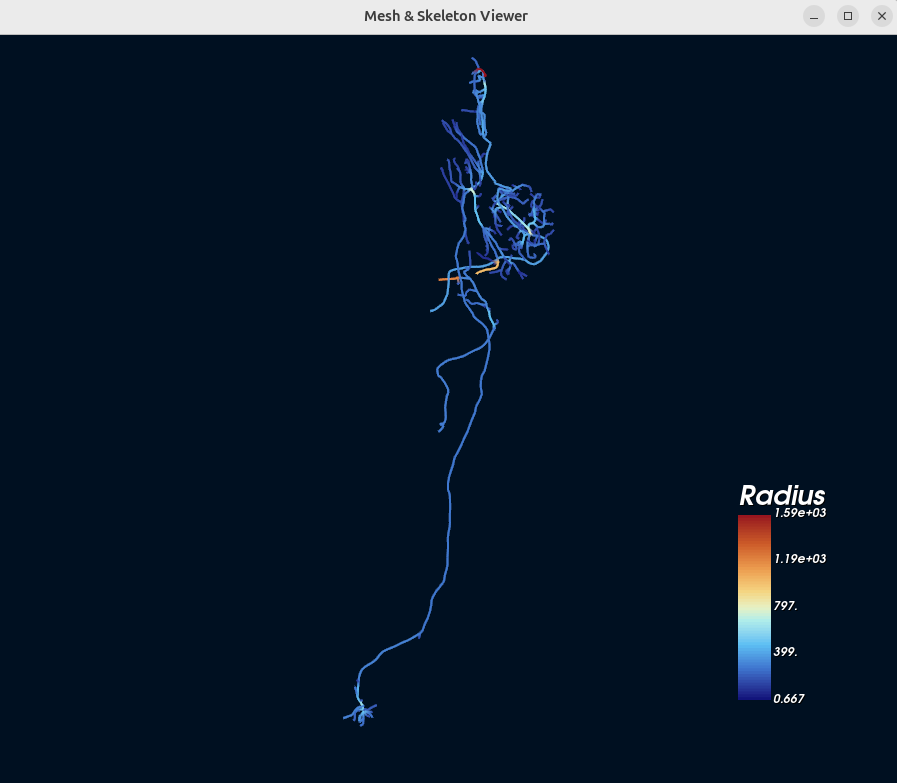
</p>

# License
The tracertools package is licensed under the GNU General Public License v3.0. See the [LICENSE](https://github.com/jaybgager/tracertools/blob/main/LICENSE) file for more details.