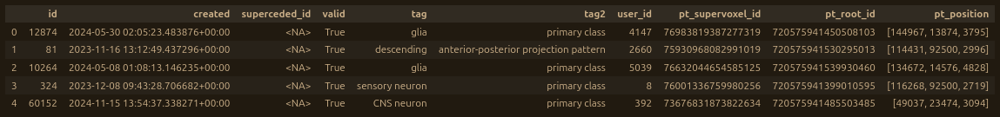

# Overview
The tracertools package is a collection of Python functions designed to streamline common tasks for connectomics researchers, particularly those related to the proofreading process. 

# Installation
Quick installation with pip isn't supported yet (but is planned for the future), so you'll have to intall the tracertools package manually from this GitHub repository by doing the following:

1. Open a terminal and navigate to the directory where you want the tracertools package to be stored.
2. Run the code `git clone https://github.com/jaybgager/tracertools.git` to make a local copy of the package at the location you naviagated to in step one. This will be create a folder named tracertools in that directory that's linked to the GitHub repository.
3. In the terminal, navigate one folder down, so that you're in the top-level (root) folder of the tracertools package by running the command `cd tracertools`.
4. In the terminal, run the command `pip install -e .`. This will tell Python's default installer, pip, to add the folder you're currently in to its list of importable packages. The `-e` modifier causes this installation to be "editable", meaning that if you make changes to the code stored in the tracertools folder, they'll take effect when you import tracertools into a python script. This is important for keeping the package up-to-date, so you don't have to reinstall it every time there are changes. This also lets you expriment with modifying the tools to meet your own needs. The `.` at the end just tells pip to install everything at the current directory location.

Now whenever you need to use a tracertools function, you can simply import it like any other package using the "import tracertools" code in any python script. Then, when you want to use a function, you add `tracertools.` in front of it. For example, if you wanted to use the `get_current_seg_ids()` function, you would use the following code:

```
import tracertools
fresh_ids = tracertools.get_current_seg_ids(
    datastack="brain_and_nerve_cord",
    seg_ids=[720575941586154052,720575941429544111]
)
```

You can also use and alias when importing the package; "tt" is a common choice. In that case, the above code would be modified slightly to look like this:

```
import tracertools as tt
fresh_ids = tt.get_current_seg_ids(
    datastack="brain_and_nerve_cord",
    seg_ids=[720575941586154052,720575941429544111]
)
```

# Glossary of Common Terms
Some terms used in the function descriptions are either uncommon or are used here to mean something very specific in the context of this package. These are defined below:

**bucket**\
A server where files can be stored and accessed remotely. Often used for publicly hosting neuroglancer volumes containing meshes, annotation layers, or electron microscope (EM) image layers. Can also be used to host data tables for things like cell type labels, proofreading status, or synapse data. The functions that begin with the prefix `bucket_` relate to reading from and writing to buckets using the [cloudfiles](https://github.com/seung-lab/cloud-files) Python package.

**CAVE**\
Connectome annotation versioning engine, the software used to manage and interact with backend information about datastacks . This is done with the [caveclient](https://github.com/CAVEconnectome/CAVEclient) Python package, thorough documentation for which can be found [here](https://caveclient.readthedocs.io/en/latest/).

**chunkedgraph/pychunkedgraph/pcg**\
The chunkedgraph is an organizational structure that holds the information about which supervoxels belong to which segments. It's created and managed by the [pychunkedgraph (pcg) python package](https://github.com/CAVEconnectome/PyChunkedGraph). Individual supervoxels are always considered to belong to the lowest layer, making them the "level 1 nodes", or "L1 nodes" for short. All the supervoxels belonging to a segment within a given cube of space, referred to as a "chunk", will be grouped together into a level 2 (L2) node. Multiple L2 nodes are grouped into an L3 node and so on until you reach a layer that contains all the supervoxels in the whole segment. For a more detailed explanation, read [this description](https://caveclient.readthedocs.io/en/latest/guide/chunkedgraph.html). Working with different layers can have advantages. For example, the L1 layer (usually just referred to as "the supervoxels") can provide detailed information at the cost of computational power, while the L2 nodes can provide information faster for less processing power, like cached 3D volume measurements - at the cost of being less reliable in certain contexts.

**cloudvolume**\
A Python package that allows reading and writing of neuroglancer volumes directly in RAM without having to write to a hard drive, documentation for which can be found [here](https://github.com/seung-lab/cloud-volume). Used in a number of processes including mesh-related operations, creating and hosting volumes both locally or on a bucket, and spatial segment lookup.

**DataFrame/df**\
A type of python object generated using the [Pandas](https://www.w3schools.com/python/pandas/default.asp) python package. Similar to a table or spreadsheet, but with various optimizations for searching and performing calculations on the data it contains. Commonly used as the storage format for CAVE tables of anntoations, edits, or segment information. Often abbreviated "df".

**dataset**\
The original image data (usually in the form of raw electron microscope images) for a specific brain (or other piece of tissue). Often identified by a descriptive acronym (e.g. Brain and Nerve Cord (BANC), Female Adult Fly Brain (FAFB)) or by the name of the organism that the tissue came from (e.g. "Minnie", "Basil"). This term is sometimes used interchangeably with "datastack" in other media, but won't be here.

**datastack**\
All the data associated with a particular project associated with a given dataset. Multiple datastacks can be associated with a single dataset (e.g. "flywire_fafb_production" and "flywire_fafb_public" are both datastacks associated with the FAFB dataset). This can include aligned EM images, 3D segmentation data, and tables of information for things like synapses, cell type labels, or nucleus locations. It may also include neuron skeletons, neuropil mesh layers, and other stack-specific information. This term is sometimes used interchangeably with "dataset" in other media, but won't be here.

**edge (graph)**\
A general term for the connection between two nodes in a graph. This could be a synapse between neurons, a connection between supervoxels in the same segment, or a link between two vertices of a mesh. Often stored as two numbers that in some way reference the ID or position of their endpoints in a list. 

**edge (mesh)**\
The lines connecting a mesh's vertices, representing the places where the mesh surface changes direction. Stored as pairs of index numbers pointing to the position of their endpoints in the mesh's list of vertices (e.g. [vertex A index #, vertex B index #])

**face**\
The flat planes that make up the surface of a 3D mesh. Can be any shape, but generally stored as triangles (sometimes called "tris") for rendering and mathematical analysis purposes. Can be stored either as lists/arrays of 3 points or 3 edges, depending on useage. May also be associated with a normal.

**graphene**\
A data format backed by pychunkedgraph, used by cloudvolume and the Seung Lab's custom version of neuroglancer, documentation for which can be found [here](https://github.com/seung-lab/cloud-volume/wiki/Graphene). If you see the term "graphene" in the address for a segmentation layer, it generally indicates that it's linked to the chunkedgraph in some way and will therefore show up as a "painted" overlay in the 2D window of neuroglancer, allowing a user to show or hide segments by double-clicking within them in 2D. Contrast with the term "precomputed", which generally indicates a static mesh that isn't connected to the chunkedgraph and therefore won't show up as a "painted" overlay in the 2D window of neuroglancer.

**mesh**\
A 3-dimensional shape, often representing a neuron, but sometimes used to depict other structures like organelles, nuclei, neuropils, or simply regions of space. Stored in literal terms as a collection of vertices, edges, and faces. A mesh is considered "watertight" if all its triangular faces are connected to exactly 3 other triangular faces (i.e. there are no "holes"). Many formats for storing mesh information exist, but this package primarily uses either those found in neuroglancer volumes or sometimes OBJ files. 

**neuroglancer (NG)**\
A user interface (UI) for interacting with the 3D segmentation and rendering of neurons and other biological structures, the documentation for which can be found [here](https://github.com/google/neuroglancer). There are multiple branches of NG for specific purposes, like [FlyWire](https://github.com/seung-lab/ng-extend/tree/flywire) or [Spelunker](https://github.com/seung-lab/neuroglancer/tree/spelunker). Most of the functions in this package are built for use with Spelunker, the Seung Lab's current customized version of NG.

**normal (mesh)**\
A ray (line with a direction) aimed perpendicular (sometimes reffered to as "orthogonal") to a flat plane. Often used to indicate what direction a mesh face is oriented for the purposes of rendering lighting.

**precomputed**\
A common type of formatting for neuroglancer data layers that relies on doing complex mathematical operations ahead of time (pre-computing) to allow faster use by the end user. If you see the term "precomputed" in the address for a segmentation layer, it generally indicates that it's a static mesh that isn't connected to the chunkedgraph and therefore won't show up as a "painted" overlay in the 2D window of neuroglancer. Contrast with the term "graphene", which indicates that a mesh is linked to the chunkedgraph in some way and will therefore show up as a "painted" overlay in the 2D window of neuroglancer, allowing a user to show or hide segments by double-clicking within them in 2D. 

**resolution**\
The actual, physical dimensions in nanometers represented by one "unit" in the x, y, and z directions of a 3D coordinate system, stored as a list/array of 3 numbers (e.g. `[4, 4, 45]` for the voxel dimensions in the "brain and nerve_cord" datastack). Common derived terms include "viewer resolution" (the default voxel resolution used when viewing a datastack in neuroglancer), "mip0 resolution" (the voxel resolution of the raw electron microscope images for a dataset), and "nanometer resolution" (where the x-, y-, and z-resolutions are all 1 nanometer, often used for backend spatial information storage and mathematical calculations).

**root ID**\
An umbrella term that can refer to the numeric identifier attached to a single supervoxel, chunkedgraph node, or segment. Appropriate to use when the entity in question can't be known ahead of time, as in the get_roots_from_points() function, which can return either a segment or supervoxel ID dependingon the user's input. Often used in other sources interchangeably with the term "segment ID", but won't be here.

**segmement/segmentation**\
The current group of supervoxels that make up one or more neurons and their overall representation in 3D. Associated with a unique 18-digit numeric identifier (segment ID / seg ID) for a given version of a single segment. The term "segment ID" is often used interchangeably with the term "root ID" in other sources, but won't be here.

**supervoxel**\
The smallest rearrangeable unit of a 3D segment, made up of multiple voxels. Not a consistent size. Sometimes referred to as the "watershed" layer because of [the type of algorithm](https://en.wikipedia.org/wiki/Watershed_(image_processing)) that led to their creation. Supervoxels cannot be broken apart, a quality sometimes referred to as being "atomic" (i.e. the smallest unbreakable constituent part of something). When referenceing the "nodes"/"leaves"/"layers" of the chunkedgraph, supervoxels are L1 - the foundational level. At any given time, a supervoxel will "belong to" a specific segment (and will therefore be associated with that segment's ID), but this assignment will change if that segment is edited.

**vertex**\
A single point in 3D space connected to other points. Used to represent the boundaries of a 3D mesh. Stored as a list or array of 3 numbers (e.g. `[1,2,3]`) corresponding to the point's x, y, and z coordinates, either in nanometers, or in voxels - the measurements for which may change depending on the voxel resolution of the datastack you're working with. Plural vertices.

**volume**\
A collection of neuroglancer-related assets that can include 2D image layers, 3D segmentation and meshing, segment skeletons, and annotations. Stored in a single folder/directory often named "image". Several formats exist depending on the type of mesh being used, more documentation about which can be found [here](https://github.com/google/neuroglancer/blob/master/src/datasource/precomputed/meshes.md). 

**voxel**\
One unit of 3D space, shaped like a rectangular prism, the actual spatial dimensions of which vary from datastack to datastack. Compare to a 2-dimensional pixel. Multiple voxels are grouped together to form a supervoxel.

# Functions
WORK IN PROGRESS
Below are basic descriptions of each function in the tracertools package, with instructions on their use. Examples will be added at a alter date.

### bucket_convert_colons
Converts file names that include colons to a Windows-safe alternative and back. Takes a string with the `file_path` argument. By default, converts any colons `:` in the string to triple-underscores `___`. If the `to_windows` argument is set to `False`, converts triple underscores back to colons. Used to allow creation and download/upload of neuroglancer legacy-format volumes (which by necessity must include colons in several file names) on Windows machines (which strictly prohibit the use of colons in file names).

Example (to Windows):
```
# INPUT

import tracertools as tt

print(
    tt.bucket_convert_colons(
        file_path = "home/user/volumes/vol_01/mesh/1:0:1"
    )
)

# OUTPUT

"home/user/volumes/vol_01/mesh/1___0___1"
```

Example (from Windows):
```
# INPUT

import tracertools as tt

print(
    tt.bucket_convert_colons(
        file_path = "home/user/volumes/vol_01/mesh/1___0___1",
        to_windows = False,
    )
)

# OUTPUT

"home/user/volumes/vol_01/mesh/1:0:1"
```

### bucket_delete_file
Deletes a file on a cloudfiles-managed bucket. Takes an absolute file path on a cloudfiles-managed bucket as a string with the `file_path` argument and deletes the file. Requires write access to the chosen bucket.

### bucket_delete_folder
Deletes a folder and all its contents on a cloudfiles-managed bucket. Takes an absolute folder path on a cloudfiles-managed bucket as a string with the `folder_path` argument and deletes the folder, including everything contained within. Prompts the user with a confirmation window where they must type `DELETE` and hit enter to prevent accidental deletion. Requires write access to the chosen bucket.

### bucket_download_file
Downloads a file from a cloudfiles-managed bucket. Takes an absolute file path on a cloudfiles-managed bucket as a string with the `bucket_path` argument and downloads the file. Tries to find a folder called `Downloads` in the home directory by default, but a specific absolute path to a different location can be optionally passed as a string with the `download_path` argument.

### bucket_download_folder
Downloads a folder from a cloudfiles-managed bucket. Takes an absolute folder path on a cloudfiles-managed bucket as a string with the `bucket_path` argument and downloads the folder and all its contents. Tries to find a folder called `Downloads` in the home directory by default, but a specific absolute path to a different location can be optionally passed as a string with the `download_path` argument.

### bucket_move_file
Moves a file from one folder to another on a cloudfiles-managed bucket. Takes an absolute file path on a cloudfiles-managed bucket as a string with the `file_path` argument and moves it to a new folder location on the bucket passed as a string of the absolute path to that folder with the `new_folder_path` argument. Requires write access to the chosen bucket.

### bucket_rename_file
Renames a file in-place on a cloudfiles-managed bucket. Takes an absolute file path on a cloudfiles-managed bucket as a string with the `file_path` argument and renames using a string passed with the `new_name` argument. The new name should just be the name of the file (not an absolute path that includes any folders it was contained within) with the file extension if one was present in the original name. Requires write access to the chosen bucket.

### bucket_upload_file
Uploads a file to a cloudfiles-managed bucket. Takes an absolute file path on your local machine to a file you want to upload as a string with the `local_path` argument and an absolute folder path to a bucket folder where you want the file to be saved as a string with the `bucket_path` argument, and copies your local file to the bucket location specified. If folders that don't yet exist are included in the `bucket_path` argument, they'll be created. Requires write access to the chosen bucket.

### bucket_upload_folder
Uploads a folder to a cloudfiles-managed bucket. Takes an absolute folder path on your local machine to a folder you want to upload as a string with the `local_path` argument and an absolute folder path to a bucket folder where you want the file to be saved as a string with the `bucket_path` argument, and coppies the contents of your local folder to the folder specified on the bucket. Note that the last folder in the bucket path will be the new top-level folder (i.e. if your local folder is called "image" and you want to put it at a bucket location of "bucket/test_images" you should set the `bucket_path` argument equal to `bucket/test/images/image`). This format is intended to allow you to rename the folder when uploading if desired. If folders that don't yet exist are included in the `bucket_path` argument, they'll be created. Requires write access to the chosen bucket.

### calc_3d_distance
Calculates the distance between two points in 3D. Takes two points as lists of 3 integers representing their x,y, and z coordinates with the `point_a` and `point_b` arguments and a the resolution of the coordinate system as a list of 3 integers with the `res` argument, and returns the distance between the two points as a float. Units will be the same as whatever was used for the `res` argument.

Example:
```
# INPUT

import tracertools as tt

print(
    tt.calc_3d_distance(
        point_a = [1,2,3],
        point_b = [4,5,6],
        res = [4,4,45],
    )
)

# OUTPUT

136.0624856453828
```

### calc_avg_point_coords
Gets the average point coordinates from a list of point coordinates. Takes a list of point coordinates as lists of 3 ints with the `points` argument and returns coordinates for a single point that represents the average of all the points in the list. By default returns result as list of nearest int values, but exact float values can be obtained insted by setting `exact_value` argument to `True`.

Example:
```
# INPUT

import tracertools as tt

print(
    tt.calc_avg_point_coords(
        points = [
            [1,4,3],
            [0,1,2],
            [2,1,3],
        ],
    )
)

# OUTPUT

[1,2,3]
```
Example (Exact Values):
```
# INPUT

import tracertools as tt

print(
    tt.calc_avg_point_coords(
        points = [
            [1,4,3],
            [0,1,2],
            [2,1,3],
        ],
        exact_value = True
    )
)

# OUTPUT

[1.0, 2.0, 2.6666666666666665]
```

### calc_bbox_corners_from_center
Calculates the point coordinates for the corners of a rectangular prism shaped bounding box based on a centerpoint and a set of dimensions. Takes a list of 3 ints with the `center_point` argument and a set of dimensions in the x-, y-, and z-dimensions as a list of ints with the `dims` argument and returns a list of two lists of 3 ints representing the corners of a bounding box of the requested dimensions centered on the requested point. If odd dimension values are submitted they'll be rounded down to the next even integer to avoid using floats for the corner coordinates.

Example:
```
# INPUT
import tracertools as tt

print(
    tt.calc_bbox_corners_from_center(
        center_point = [1,2,3],
        dims = [10,7,4],
    )
)

# OUTPUT

[[-4, -1, 1], [6, 5, 5]]
```


### calc_line_triangle_intersect
Calculates the point where a line segment and a triangular plane intersect, if any. Takes a line segment as an array of two arrays of 3 floats or ints representing the endpoints with the `line` argument (e.g. `[[x1,y1,z1],[x2,y2,z2]]`) and a triangular plane as an array of 3 arrays of 3 floats or ints representing the point coordinates of the vertices with the `triangle` argument (e.g. `[[x1,y1,z1],[x2,y2,z2],[x3,y3,z3]]`) and returns either an array of 3 floats representing the point coordinates where the line intersects the triangular plane (e.g. `[x,y,z]`) or a `None` value if none exist. By default, rounds the results to the nearest integer, but more detailed results can be obtained by setting the `precision` argument to the number of decimal places desired. Warning: using high precision (e.g. 16+ decimal places) with low numbers (e.g. [1,1,1]) can cause false negatives. This is due to extremely small rounding errors when calculating floating point math.

Example:
```
# INPUT

import tracertools as tt
import numpy as np

print(
    tt.calc_line_triangle_intersect(
        line = np.array(
            [
                [0,0,0],
                [1,2,3]
            ]
        ),
        triangle = np.array(
            [
                [2,0,0],
                [0,3,0],
                [0,0,4]
            ]
        ),
    )
)

# OUTPUT

[1.,1.,2.]

```

Example (higher precision):
```
# INPUT

import tracertools as tt
import numpy as np

print(
    tt.calc_line_triangle_intersect(
        line = np.array(
            [
                [0,0,0],
                [1,2,3]
            ]
        ),
        triangle = np.array(
            [
                [2,0,0],
                [0,3,0],
                [0,0,4]
            ]
        ),
        precision=3,
    )
)

# OUTPUT

[0.522 1.043 1.565]

```

### calc_seg_mesh_intersect
Calculates all points where the skeleton of a segment intersects a mesh, if any exist. Takes a datastack name as a string with the `datastack` argument, a list of segment IDs as ints with the `seg_ids` argument, and the address of a neuroglancer mesh as a string with the `mesh_address` argument (e.g. "https://c10s.pni.princeton.edu/tracers/jay/mesher_demo/example_01|neuroglancer-precomputed:") and by default returns a list of bool (True/False) values indicating which segments' skeletons intersect the chosen mesh. Optionally setting the `return_intersects` argument to True will instead return a list of values that are either lists of all the point coordinates at which each segment intersects the mesh or a `None` value if no intersection points exist.

Example:
```
# INPUT

import tracertools as tt

tt.calc_seg_mesh_intersect(
    datastack="brain_and_nerve_cord", 
    seg_ids=[720575941526718564,720575941524165453], 
    mesh_address="https://c10s.pni.princeton.edu/tracers/examples/banc_mesh_01|neuroglancer-precomputed:",
)

#OUTPUT

[True,False]
```

Example (return intersects):
```
# INPUT

import tracertools as tt

tt.calc_seg_mesh_intersect(
    datastack="brain_and_nerve_cord", 
    seg_ids=[720575941526718564,720575941524165453], 
    mesh_address="https://c10s.pni.princeton.edu/tracers/examples/banc_mesh_01|neuroglancer-precomputed:",
    return_intersects=True,
)

#OUTPUT

[
    [
        array([121305., 181906.,   4627.]),
        array([123200., 172384.,   4720.]),
        array([124027., 174945.,   5243.]),
        array([124240., 176101.,   5346.]),
        array([123934., 175092.,   5244.]),
        array([127158., 175525.,   4693.]),
        array([125175., 175250.,   5344.]),
        array([125127., 174504.,   5263.]),
        array([125315., 175057.,   5311.]),
        array([122142., 175971.,   4855.])
    ],
    None
]
```

### calc_skeleton_mesh_intersect
Calculates all points where a skeleton intersects a mesh, if any exist. Takes a segment's skeleton as an (n,2,3)-shape numpy array of floats with the `bones` argument and a list of triangular mesh faces as an (n,3,3)-shape numpy array of floats with the `mesh_triangles` argument and returns a list of numpy arrays of 3 floats representing the intersection points between the skeleton and the mesh OR a None value if no intersection points were found.

Example:

Since this code requires a skeleton's bones and a mesh's triangles, here's an example of how you could get those using other tracertools functions.

```
# INPUT

import tracertools as tt

# this part gets the skeleton for a given segment
skel = tt.get_seg_skeletons(
    datastack="brain_and_nerve_cord",
    seg_ids=[720575941526718564]
)[0]

# this part gets the list of individual skeleton edges, or "bones", from the skeleton
bone_list = tt.get_bones(
    datastack="brain_and_nerve_cord", 
    skeleton=skel
)

# this part gets a list of all the mesh's faces, or "triangles"
triangles = tt.get_mesh_triangles(
    volume_path="https://c10s.pni.princeton.edu/tracers/examples/banc_mesh_01|neuroglancer-precomputed:"
)
```

Now that you have a list of bones and triangles, you can use the following code to check if any of the bones intersect any of the triangles:

```
# INPUT

intersections = tt.calc_skeleton_mesh_intersect(
    bones=bone_list, 
    mesh_triangles=triangles
)

print(intersections)

# OUTPUT

[array([121305., 181906.,   4627.]),
 array([123200., 172384.,   4720.]),
 array([124027., 174945.,   5243.]),
 array([124240., 176101.,   5346.]),
 array([123934., 175092.,   5244.]),
 array([127158., 175525.,   4693.]),
 array([125175., 175250.,   5344.]),
 array([125127., 174504.,   5263.]),
 array([125315., 175057.,   5311.]),
 array([122142., 175971.,   4855.])]
```

### check_seg_freshness
Checks if a list of segment IDs are current or outdated. Takes a datastack name as a string with the `datastack` argument and a list of segment IDs as ints with the `seg_ids` argument and returns a list of bools (True/False values) indicating if each segment ID in the submitted list is current (True) or outdated (False).

Example:
```
# INPUT
import tracertools as tt

# defines a list of potentially-outdated IDs
stale_ids = [
    720575940379940739, # outdated #
    720575941535667946, # current #
    720575941539599858, # current #
    720575940380068115, # outdated #
    720575941609391725, # current #
    720575940380207581, # outdated #
]

is_fresh = tt.check_seg_freshness(
    datastack="brain_and_nerve_cord", 
    seg_ids=stale_ids,
)

print(is_fresh)

# OUTPUT

[False, True, True, False, True, False]
```

### check_seg_proofread_status
Checks if a list of segments have been marked proofread or not. Takes a datastack name as a string with the `datastack` argument and a list of segment IDs as ints with the `seg_ids` argument and returns a list of bools (True/False values) indicating if each segment ID in the submitted list has been marked as "backbone_proofread" in the dataset's default proofreading completion table. Only works for datasets with a default proofreading table; if none exists, returns error indicating such.

Example:
```
# INPUT

import tracertools as tt

segments = [
    720575940379940739, # not proofread #
    720575941535667946, # not proofread #
    720575941539599858, # not proofread #
    720575940380068115, # not proofread #
    720575941609391725, # proofread #
    720575940380207581, # not proofread #
]

is_proofread = tt.check_seg_proofread_status(
    datastack="brain_and_nerve_cord", 
    seg_ids=segments,
)

print(is_proofread)

# OUTPUT

[False, False, False, False, True, False]
```

### convert_coord_res
Converts a set of point coordinates from one resolution to another. Takes a list of 3 ints representing the xyz coordinates of a point with the `point_coords` argument, as well as two other lists of 3 ints representing the current and desired resolutions with the `res_current` and `res_desired` arguments, respectively, and returns a list of 3 ints representing the original points translated into the new coordinate resolution.

Example:

```
# INPUT

import tracertools as tt

# creates a list of banc-resolution coordinates
banc_coords = [125283, 118263, 2860]

# converts the banc-resolution coords to nanometer-resolution coords
# this is often necessary for performing spatial math calculations on points
nm_coords = tt.convert_coord_res(
    point_coords = banc_coords, 
    res_current=[4, 4, 45], 
    res_desired=[1, 1, 1],
)

print(nm_coords)

# OUTPUT

[501132, 473052, 128700]
```

### count_synapses
Counts the number of synapses each segment in a list has associated with it. Takes a datastack name as a string with the argument `datastack` and a list of segmnet IDs as a list of ints with the `seg_ids` argument and returns a list of ints representing the total synapses for each segment. Optionally, the `detailed_results` argument can be set to True in order to get the results as a list of dictionaries with specific counts for incoming and outgoing synapses instead. 

Example:
```
# INPUT

import tracertools as tt

synapses = tt.count_synapses(
    datastack="brain_and_nerve_cord", 
    seg_ids = [
        720575940380068115,
        720575941609391725,
        720575940380207581,
    ], 
)

print(synapses)

# OUTPUT

[0, 336, 0]
```

Example (detailed results)
```
# INPUT

import tracertools as tt

synapses = tt.count_synapses(
    datastack="brain_and_nerve_cord", 
    seg_ids = [
        720575940380068115,
        720575941609391725,
        720575940380207581,
    ], 
    detailed_results=True,
)

print(synapses)

# OUTPUT

{720575940380068115: {'all': 0, 'in': 0, 'out': 0},
 720575940380207581: {'all': 0, 'in': 0, 'out': 0},
 720575941609391725: {'all': 336, 'in': 45, 'out': 291}}
```

### count_user_sv_contribution
Counts how many unique supervoxels each user was responsible for adding or removing in order to produce a proofread segment. Takes a datastack name as a string with the `datastack` argument and the ID of a proofread segment as an int with the `completed_seg_id` argument and returns a dictionary of string user IDs as keys and total supervoxel assignments as int values.

Example:
```
# INPUT

import tracertools as tt

contribs = tt.count_user_sv_contribution(
    datastack = "brain_and_nerve_cord",
    completed_seg_id = 720575941609391725,
)

print(contribs)

# OUTPUT

{'5098': 2957, '5017': 7366, '2815': 253}
```

### get_anno_array_from_json_state_file
Extracts a numpy array of point coordinates from a point annotation layer in a locally-stored neuroglancer JSON state file. Takes the absolute filepath to a neuroglancer JSON state file on your local machine as a string with the `json_filepath` argument and the name of a point annotation layer in the JSON state you want to pull points from as a string with the `layer_name` argument and returns an (n,3)-shape numpy array of ints representing the point coordinates of each anntoation. Useful for making point cloud OBJS or meshing.

Example (using a hypothetical JSON state file called `state01.json` containing a point annotation layer called `annotation1` and which is stored in the `home/user/ng_states/` folder):
```
# INPUT

import tracertools as tt

anno_array = tt.get_anno_array_from_json_state_file(
    json_filepath="home/user/ng_states/state01.json",
    layer_name="annotation1"
)

print(anno_array)

# OUTPUT

# an (n,3)-shape numpy array containing all the points inthe annotation layer
[
    [x1, y1, z1],
    [x2, y2, z2],
    [x3, y3, z3],
    ...
    [xn, yn, zn]
]
```

### get_bones
Gets an array of viewer-resolution endpoint pairs for each edge in a nanometer-resolution osteoid-format segment skeleton. Takes a dataset name as a string with the `datastack` argument and an [osteoid](https://github.com/seung-lab/osteoid)-format skeleton object in nanometer (`[1,1,1]`) resolution with the `skeleton` argument and returns an (n,2,3)-shape numpy array representing the skeleton's edges, or "bones". Useful when calculating whether the skeleton passes through a region of space or mesh surface.

Example:

Since this code requires an osteoid-format skeleton, we can get that using the get_seg_skeletons() function.

```
import tracertools as tt

# this part gets the skeleton for a given segment
skel = tt.get_seg_skeletons(
    datastack="brain_and_nerve_cord",
    seg_ids=[720575941526718564]
)[0]
```

Now that we have a skeleton, we can feed it into get_bones():

```
bones = tt.get_bones(
    datastack="brain_and_nerve_cord", 
    skeleton=skel
)

print(bones)

# OUTPUT

[
    [
        [bone_1_x1, bone_1_y1, bone_1_z1],
        [bone_1_x2, bone_1_y2, bone_1_z2]
    ],
    [
        [bone_2_x1, bone2_y1, bone_2_z1],
        [bone_2_x2, bone2_y2, bone_2_z2]
    ],
    [
        [bone_3_x1, bone_3_y1, bone_3_z1],
        [bone_3_x2, bone_3_y2, bone_3_z2]
    ],
    ...
    [
        [bone_n_x1, bone_n_y1, bone_n_z1],
        [bone_n_x2, bone_n_y2, bone_n_z2]
    ]
]
```

### get_cable_lengths
Gets the total length of all the edges (sometimes called "bones") in each segment's skeleton for a list of segments. When talking about a neuron, this is a measurement of the combined length of all the neuron's branches. Units will be whatever the default unit type the datastack uses, typically nanometers. Takes a datastack name as a str with the `datastack` argument and a list of segment IDs as ints with the `seg_ids` argument and returns a list of floats representing the cable lengths of each segment. Will also print out a time estimate for skeletonization of the requested segments. These skeletons will be cached, so requesting the same skeletons multiple times won't require recalculation.

Example:

```
# INPUT

import tracertools as tt

cable_lengths = tt.get_cable_lengths(
    datastack="brain_and_nerve_cord",
    seg_ids=[
        720575941490813872,
        720575941533316995,
    ],
)

print(cable_lengths)

# OUTPUT

[1712022.370770976, 2109110.992525338]
```

### get_cave_stacks
Gets a list of all the datastacks currently available trhough the CAVE service. Requires no arguments. Returns list of strings representaing the names of all the available datastacks. These can be used to get a lot of other information like available tables, stack metadata, and tracer-format config info, as well as to set the client name for CAVEclient objects.

Example:

```
# INPUT

import tracertools as tt

stacks = tt.get_cave_stacks()

print(stacks)

# OUTPUT

[
    "stack_name_1", 
    "stack_name_2",
    ...
    "last_stack_name"
]
```

### get_cave_stack_info
Gets the official metadata information for a specific CAVE datastack, directly from the publisher of the datastack. Takes a datastack name as a string with the `datastack` argument and returns a dictionary containing the relevant stack's metadata.

Example:

```
# INPUT

import tracertools as tt

stack_info = tt.get_cave_stack_info(datastack="brain_and_nerve_cord")

print(stack_info)

# OUTPUT (as of 9 June 2026)

{'aligned_volume': {'description': 'The BANC (said "the bank") is the Brain '
                                   'And Nerve Cord, a GridTape transmission '
                                   'electron microscopy dataset of a female '
                                   "adult Drosophila melanogaster's entire "
                                   'central nervous system. Visit '
                                   'https://banc.community for more '
                                   'information.',
                    'display_name': 'BANC',
                    'id': 9,
                    'image_source': 'precomputed://gs://seunglab_lee_fly_cns_001_alignment/aligned/v0',
                    'name': 'brain_and_nerve_cord'},
 'analysis_database': None,
 'cell_identification_table': 'cell_info',
 'description': None,
 'local_server': 'https://cave.fanc-fly.com',
 'proofreading_review_table': None,
 'proofreading_status_table': 'backbone_proofread',
 'segmentation_source': 'graphene://https://cave.fanc-fly.com/segmentation/table/wclee_fly_cns_001',
 'skeleton_source': 'precomputed://https://cave.fanc-fly.com/skeletoncache/api/v1/brain_and_nerve_cord/precomputed/skeleton',
 'soma_table': None,
 'synapse_table': 'synapses_v2',
 'viewer_resolution_x': 4.0,
 'viewer_resolution_y': 4.0,
 'viewer_resolution_z': 45.0,
 'viewer_site': 'https://spelunker.cave-explorer.org/'}
```

The dictionary output above has been formatted for ease of reading using the pretty-print python module, which can be installed with `pip install pprint` and used by adding `from pprint import pprint` to your imports and replacing the `print()` command with `pprint()`. The actual default output would all be on a single line.

### get_cave_stack_tables
Gets a list of all the currently-available backend CAVE tables associated with a datastack. Takes a datastack name as a string with the `datastack` argument and returns a list of strings representing the names of the various available tables.

Example:

```
# INPUT

import tracertools as tt

tables = tt.get_cave_stack_tables(datastack="brain_and_nerve_cord")

print(tables)

# OUTPUT (as of 9 June 2026, truncated)

['peripheral_nerves',
 'neck_connective_y121000',
 'cell_ids',
...
 'leg_mn_segment_reftable_v0',
 'cell_info',
 'mitochondria_v1']
```

### get_cave_table
Gets all the data for a specific CAVE table as a pandas DataFrame object. Takes a datastack name as a string with the `datastack` argument and a table name as a string with the `table_name` argument and returns a DataFrame object containing the requested information. These tables can be very large (e.g. the table listing all the synapses for the "flywire_fafb_production" datastack has roughly 50 million entries), and may become truncated in some circumstances. For more detailed CAVE table queries, the caveclient python module can be used.

Example:

```
# INPUT

import tracertools as tt

table_df = tt.get_cave_table(
    datastack="brain_and_nerve_cord",
    table_name="cell_info"
)

table_df.head()
```
OUTPUT (as of 9 June 2026):



### get_cave_table_info
Gets the metadata about a specific CAVE table as a dictionary. Takes a datastack name as a string with the `datastack` argument and a table name as a string with the `table_name` argument and returns a dictionary of the table's metadata.

Example:

```
# INPUT

import tracertools as tt

table_info = tt.get_cave_table_info(
    datastack="brain_and_nerve_cord",
    table_name="cell_info"
)

print(table_info)

# OUTPUT (as of 9 June 2026)

{'aligned_volume': 'brain_and_nerve_cord',
 'created': '2023-10-30T00:00:01.188701',
 'description': 'A general-purpose cell type / cell information table... (truncated)',
 'flat_segmentation_source': None,
 'id': 18382,
 'last_modified': '2026-06-09T02:34:36.131912',
 'last_updated': '2026-06-09T01:00:00.159181',
 'notice_text': None,
 'pcg_table_name': 'wclee_fly_cns_001',
 'read_permission': 'PUBLIC',
 'reference_table': None,
 'schema': 'bound_double_tag_user',
 'schema_type': 'bound_double_tag_user',
 'segmentation_source': None,
 'table_name': 'cell_info',
 'user_id': '4741',
 'valid': True,
 'voxel_resolution': [4.0, 4.0, 45.0],
 'write_permission': 'PRIVATE'}
```
The dictionary output above has been formatted for ease of reading using the pretty-print python module, which can be installed with `pip install pprint` and used by adding `from pprint import pprint` to your imports and replacing the `print()` command with `pprint()`. The actual default output would all be on a single line.

### get_config
Gets the tracer-format config dictionary for a specific datastack if one exists. To get a list of the datastacks that currently have config support, use the `get_supported_configs()` function. Takes a datastack name as a string with the `datastack` argument and returns a dictionary that can be used for a number of other functions. Each dictionary will have the following keys:

**"resolution"**\
The dimensions in nanometers used by the datastack's default viewer for a single voxel.

**"volume_size"**\
The overall dimensions in nanometers of the volume for the datastack's segmentation.

**"em_source_url"**\
The address where the electron microscope images used for the 2D layer in neuroglancer are hosted. This address can be pasted into the `source` field of a neuroglancer image layer to view the corresponding EM image stack, provided the user has read access.

**seg_source_url**\
The address where the chunkedgraph-linked segmentation is hosted. This address can be pasted into the `source` field of a neuroglancer segmentation layer to load the corresponding segmentation in both 2D and 3D, provided the user has read access.

**skeleton_source_url**\
The address where the precomputed cache of segment skeletons for this datastack is stored, if one exists.

**synapse_table_name**\
The name of the official synapse table for this datastack, if one exists. Can be used with `get_cave_table()` and `get_cave_table_info()` functions.

**"syn_pre_coord_col" / "syn_post_coord_col"**\
The names of the columns in the synapse table that contain the point coordinates associated with the pre- and post-synaptic sides of a given synapse annotation. Useful when automating the process of adding synapses to a programmatically-generated link.

**"syn_pre_seg_col" / "syn_post_seg_col"**\
The names of the columns in the synapse table that contain the segment ID associated with the pre- and post-synaptic sides of a given synapse annotation. Useful when automating the process of adding segment-linked synapses to a programmatically-generated link.

**"syn_pre_sv_col" / "syn_post_sv_col"**\
The names of the columns in the synapse table that contain the supervoxel ID associated with the pre- and post-synaptic sides of a given synapse annotation.

**"syn_nt_col"**\
The name of the column in the synapse table that contains the most likely neurotransmitter prediction for a given synapse, if one is available. Methods for predicting neurotransmitters may vary from one datastack to another.

**"syn_cleft_score_col"**\
The name of the column in the synapse table that contains the cleft score calculation for a given synapse, if one is available. Often used as a rough metric for how reliable the automated detection of a given synapse is.

**"cell_info_table_name"**\
The name of the information table for known cells in a dataset, if one exists.

**"soma_table_name"**\
The name of the table for detected somas / cell bodies, if one exists.

**"proofreading_table_name"**\
The name of the table containing a list of all neurons and their current proofreading status, if one exists. Format may vary.

**"proofreading_table_seg_col"**\
The name of the column in the proofreading table corresponding to the ID of a given segment, if one exists. Useful for segment-ID-based lookup.

**"proofreading_table_status_col"**\
The name of the column in the proofreading table corresponding to the proofreading status of a given segment, if one exists.

**"local_server_url"**\
The address of the local server for the backend data of this datastack. Will often be used in the construction of segmentation and skeleton host urls.

**"viewer_site_url"**\
The base address of the version of neuroglancer this datastack is built to work with.

**"main_stack_mesh_url"**\
The address where the volume containintg the overall mesh encompassing a whole datastack is hosted, if one exists. These are usually formatted as precomputed static meshes.

**"neuropil_mesh_url"**\
The address where the volume containing any neuropil meshes are hosted, if one exists. These are usually formatted as precomputed static meshes.

**"default_view_point"**\
A list of point coordinates for the tracer-chosen default focal point used when generating neuroglancer links programmatically. Often close to the center of the overall 3D mesh.

**"default_zoom_2d"**\
A float or int value for setting the tracer-chosen default 2D/EM viewer zoom level when constructing programmatically-generated neuroglancer links.

**"default_zoom_3d"**\
A float or int value for setting the tracer-chosen default 3D viewer zoom level when constructing programmatically-generated neuroglancer links.

**"default_angle_3d"**\
A list of 4 float or int values for setting the tracer-chosen default 3D viewer angle when constructing programmatically-generated neuroglancer links.

**"shortlink_server_url"**\
The address for the link-shortening state service to compress the default full neuroglancer url into shortlinks pointing to saved states that are more usable with common messaging services which impose character limits, if one exists for this datastack.

**"here_be_monsters"**\
The address for the tracer-created legacy-format neuroglancer volume containing precomputed single-resolution unsharded static meshes of all the known rough spots in a given datastack. Useful for triaging lists of segments during proofreading with the `calc_seg_mesh_intersect()` function. Used by the `triage_segs()` function for this purpose. These maps are living documents that may be updated at any time during the life of a datastack as new rough spots are found or existing meshes are improved.

**Unique Config Entries**\
Some datastacks may also have their own unique config entries to suit the needs of the project. Common examples are host urls for the segmentations or meshes of other datastacks that have been aligned for comparison purposes, custom mesh hosting urls for specific structures like nerve bundles, or precomputed annotation layers for synapses, nuclei, organelles, or other structures.

Example:

```
# INPUT

import tracertools as tt

config = tt.get_config("brain_and_nerve_cord")

print(config)

# OUTPUT (as of 9 June 2026)

{'cell_info_table_name': 'cell_info',
 'default_angle_3d': [0, 1, 0, 0],
 'default_view_point': [125563, 118181, 2850],
 'default_zoom_2d': 4.12,
 'default_zoom_3d': 360849,
 'em_source_url': 'precomputed://gs://seunglab_lee_fly_cns_001_alignment/aligned/v0',
 'here_be_monsters': 'nokura://tracers/triage_meshes/banc/image',
 'local_server_url': 'https://cave.fanc-fly.com',
 'main_stack_mesh_url': 'precomputed://gs://lee-lab_brain-and-nerve-cord-fly-connectome/region_outlines',
 'manc_seg': 'precomputed://gs://lee-lab_brain-and-nerve-cord-fly-connectome/imported_meshes/manc_v1.2.1_meshes_elastix_tpsreg_240721',
 'neuropil_mesh_url': None,
 'proofreading_table_name': 'backbone_proofread',
 'proofreading_table_seg_col': 'pt_root_id',
 'proofreading_table_status_col': 'proofread',
 'resolution': [4, 4, 45],
 'seg_source_url': 'graphene://middleauth+https://cave.fanc-fly.com/segmentation/table/wclee_fly_cns_001',
 'shortlink_server_url': None,
 'skeleton_source_url': 'precomputed://https://cave.fanc-fly.com/skeletoncache/api/v1/brain_and_nerve_cord/precomputed/skeleton',
 'soma_table_name': None,
 'syn_cleft_score_col': None,
 'syn_nt_cols': None,
 'syn_post_coord_col': 'post_pt_position',
 'syn_post_seg_col': 'post_pt_root_id',
 'syn_post_sv_col': 'post_pt_supervoxel_id',
 'syn_pre_coord_col': 'pre_pt_position',
 'syn_pre_seg_col': 'pre_pt_root_id',
 'syn_pre_sv_col': 'pre_pt_supervoxel_id',
 'synapse_table_name': 'synapses_v2',
 'viewer_site_url': 'https://spelunker.cave-explorer.org/',
 'volume_size': [262144, 294912, 7010]}
 ```

The dictionary output above has been formatted for ease of reading using the pretty-print python module, which can be installed with `pip install pprint` and used by adding `from pprint import pprint` to your imports and replacing the `print()` command with `pprint()`. The actual default output would all be on a single line.


# License
The tracertools package is licensed under the GNU General Public License v3.0. See the [LICENSE](https://github.com/jaybgager/tracertools/blob/main/LICENSE) file for more details.